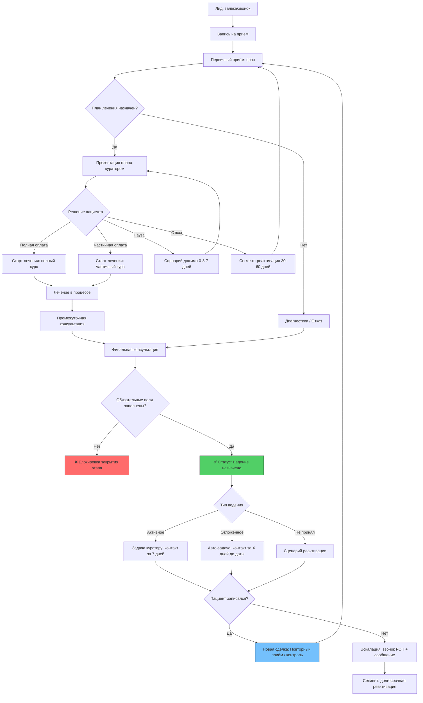
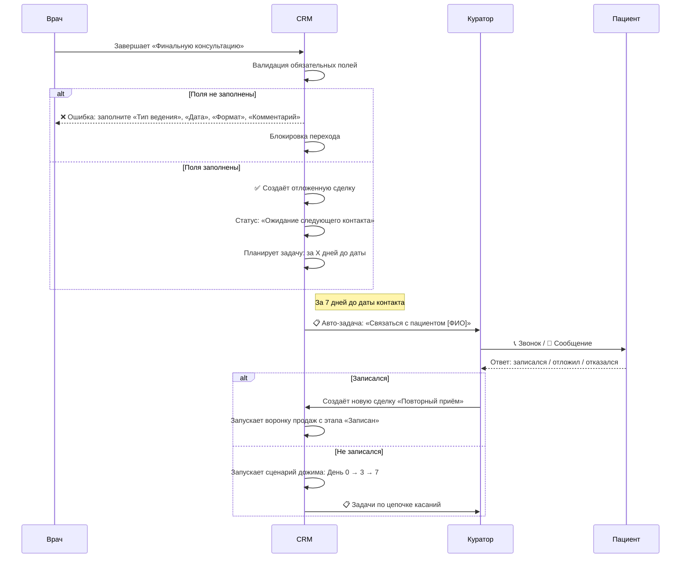
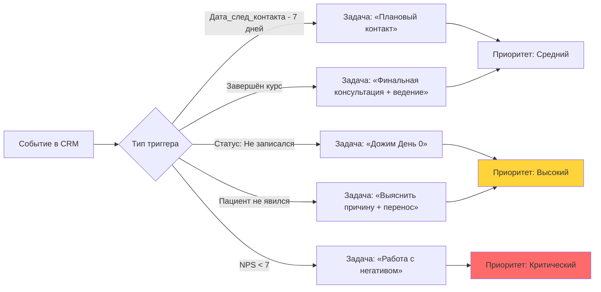

# 🏥 УЛУЧШЕННАЯ CRM ДЛЯ МЕДИЦИНСКИХ УСЛУГ
## Техническое задание + Схема логики
### Институт Движения | Версия 1.0 | 29.04.2026

---

## 📑 ОГЛАВЛЕНИЕ

1. [Общие положения](#1-общие-положения)
2. [Схема логики CRM (Mermaid)](#2-схема-логики-crm-mermaid)
3. [Модель данных: обязательные поля](#3-модель-данных-обязательные-поля)
4. [Бизнес-логика и автоматизация](#4-бизнес-логика-и-автоматизация)
5. [Воронки и статусы](#5-воронки-и-статусы)
6. [Сегментация пациентов](#6-сегментация-пациентов)
7. [Интеграция с 1С:Медицина](#7-интеграция-с-1смедицина)
8. [Отчётность и KPI](#8-отчётность-и-kpi)
9. [Требования к интерфейсу](#9-требования-к-интерфейсу)
10. [Критерии приёмки](#10-критерии-приёмки)

---

## 1. ОБЩИЕ ПОЛОЖЕНИЯ

### 1.1. Цель системы
Создание замкнутого цикла взаимодействия с пациентом, обеспечивающего:
- ✅ Рост среднего чека за счёт cross-sell и пакетных предложений
- ✅ Увеличение LTV через систему автоматического возврата («ведение»)
- ✅ Повышение качества обслуживания за счёт прозрачности процессов

### 1.2. Область применения
- Клиники сети «Институт Движения»
- Интеграция с 1С:Медицина (тип. конфигурация)
- Каналы коммуникации: телефон, сайт, мессенджеры, личный кабинет

### 1.3. Роли пользователей
| Роль | Доступ | Ответственность |
|------|--------|----------------|
| Врач | Чтение/запись мед.данных, назначение ведения | Заполнение полей «Тип ведения», «Срок контакта» |
| Куратор | Полный доступ к сделке, коммуникации | Дожим, возврат пациента, контроль выполнения |
| Администратор | Запись, оформление, оплата | Доходимость, первичная конверсия |
| РОП / Зав. отделением | Аналитика, управление воронкой | KPI отдела, качество процессов |
| Маркетолог | Сегменты, источники, рассылки | CPL, конверсия каналов, реактивация |

---

## 2. СХЕМА ЛОГИКИ CRM (MERMAID)

### 2.1. Основной цикл пациента (LTV-цикл)



### 2.2. Логика автоматизации после «Финальной консультации»



---

## 3. МОДЕЛЬ ДАННЫХ: ОБЯЗАТЕЛЬНЫЕ ПОЛЯ

### 3.1. Поля после «Финальной консультации» (валидация: не пропустить)

| Поле | Тип | Варианты / Формат | Обязательность | Описание |
|------|-----|-------------------|----------------|----------|
| `тип_ведения` | Выпадающий список | `контрольный_визит`<br>`поддерживающее_лечение`<br>`контроль_диагностики`<br>`комбинированное` | ✅ Обязательно | Основной тип пост-лечебного взаимодействия |
| `подтип_ведения` | Выпадающий список | Зависит от `тип_ведения`:<br>• контрольный_визит: `3мес` / `6мес` / `12мес`<br>• поддерживающее_лечение: `массаж` / `лфк` / `физио`<br>• контроль_диагностики: `мрт` / `анализы` | ✅ Обязательно | Детализация типа ведения |
| `дата_след_контакта` | Дата | ДД.ММ.ГГГГ, ≥ текущей даты | ✅ Обязательно | Триггер для авто-задач куратору |
| `формат_контакта` | Выпадающий список | `визит` / `процедура` / `диагностика` | ✅ Обязательно | Планирование ресурсов клиники |
| `комментарий_для_пациента` | Текст | До 280 символов, без мед. терминов | ✅ Обязательно | Скрипт для куратора: «зачем это пациенту» |
| `ответственный_куратор` | Справочник сотрудников | Активные кураторы отделения | ✅ Авто-подстановка | Кто ведёт пациента на этапе возврата |

### 3.2. Сегментация пациента (обязательные поля карточки)

| Поле | Тип | Значения | Когда заполняется | Для отчётов |
|------|-----|----------|-------------------|-------------|
| `тип_пациента` | Выпадающий список | `первичный` / `повторный_в_лечении` / `реактивированный` | При создании / при возврате | LTV по когортам |
| `подтип_реактивации` | Выпадающий список | `сам_вернулся` / `обзвоном` / `реклама` | Если `тип_пациента = реактивированный` | Конверсия каналов возврата |
| `география` | Выпадающий список | `местный` / `иногородний` | При первичном приёме | Логистика, загрузка |
| `источник_возврата` | Выпадающий список | `звонок` / `сообщение` / `реклама` / `рекомендация` | При повторной записи | Эффективность удержания |
| `психотип_лида` | Теги | `экономный` / `тревожный` / `решительный` / `исследователь` | При первичном контакте | Персонализация коммуникации |

---

## 4. БИЗНЕС-ЛОГИКА И АВТОМАТИЗАЦИЯ

### 4.1. Валидация «Финальной консультации»

```javascript
// Псевдокод валидации при попытке закрыть этап
function validateFinalConsultation(consultation) {
    const requiredFields = [
        'тип_ведения',
        'подтип_ведения', 
        'дата_след_контакта',
        'формат_контакта',
        'комментарий_для_пациента'
    ];
    
    const missing = requiredFields.filter(field => !consultation[field]);
    
    if (missing.length > 0) {
        return {
            success: false,
            error: `Не заполнены поля: ${missing.join(', ')}`,
            blockClose: true
        };
    }
    
    if (consultation.дата_след_контакта < new Date()) {
        return {
            success: false,
            error: 'Дата следующего контакта должна быть в будущем',
            blockClose: true
        };
    }
    
    return { success: true };
}
```

### 4.2. Сценарий автоматического возврата («Дожим»)

| День | Действие | Канал | Шаблон сообщения | Ответственный |
|------|----------|-------|------------------|---------------|
| **0** (сразу) | Задача куратору | Внутренняя | «Пациент [ФИО] не записался. Позвонить, уточнить причину, предложить альтернативу» | Куратор |
| **3** | Авто-сообщение | WhatsApp / SMS | «[Имя], напоминаем о рекомендации врача: [комментарий_для_пациента]. Ответьте, если есть вопросы — поможем записаться» | CRM |
| **7** | Повторный звонок | Телефон | Скрипт: «Вижу, вы не записались. Что-то смутило? Можем предложить [альтернатива: онлайн-консультация / рассрочка]» | Куратор |
| **14** | Эскалация | Звонок РОП | «Пациент [ФИО] в зоне риска. Требуется персональное предложение» | РОП |
| **30** | Сегментация | Внутренняя | Перевод в сегмент «Долгосрочная реактивация» | CRM |

### 4.3. Триггеры для задач куратору



---

## 5. ВОРОНКИ И СТАТУСЫ

### 5.1. Воронка продаж (основная)

```
1. Записан
   ↓
2. Пришел
   ↓
3. Прием проведен
   ↓
4. План лечения сформирован
   ↓
5. Передан куратору
   ↓
6. Презентация плана
   ↓
7. [Разветвление]
   ├── 7А. Продажа 100% → 8А. Старт лечения
   ├── 7Б. Продажа частичная → 8Б. Частичное лечение
   ├── 7В. Пауза → 8В. Дожим (сценарий 0-3-7)
   ├── 7Г. Только диагностика → 8Г. Промежуточная консультация
   └── 7Д. Отказ → 8Д. Реактивация (30-60 дней)
```

### 5.2. Воронка лечения (параллельная, привязана к пациенту)

```
1. Старт лечения
   ↓
2. Лечение в процессе
   ↓
3. Промежуточная консультация (авто-задача после 50% курса)
   ↓
4. Финальная консультация
   ↓
5. [Обязательно] Ведение назначено
   ↓
6. Завершен курс
```

### 5.3. Правила перехода между статусами

| Из статуса | В статус | Условие перехода | Авто-действия |
|------------|----------|------------------|---------------|
| Прием проведен | План лечения | Врач сохранил назначения | Задача куратору: «Подготовить презентацию» |
| Презентация | Продажа 100% | Оплата ≥90% от плана | Создание задач на расписание |
| Презентация | Продажа частичная | Оплата 30-89% | Задача на апселл после 2-й процедуры |
| Презентация | Пауза | Пациент запросил время | Запуск сценария дожима |
| Любое | Финальная консультация | Курс завершён / пациент не вернулся | Валидация обязательных полей |
| Финальная консультация | Ведение назначено | Все поля заполнены | Создание отложенной сделки |

---

## 6. СЕГМЕНТАЦИЯ ПАЦИЕНТОВ

### 6.1. Логика присвоения сегментов

```javascript
// Псевдокод определения типа пациента
function determinePatientType(patient) {
    const lastVisit = patient.last_visit_date;
    const today = new Date();
    const daysSinceLast = (today - lastVisit) / (1000 * 60 * 60 * 24);
    
    if (!lastVisit) return 'первичный';
    if (patient.active_treatment) return 'повторный_в_лечении';
    if (daysSinceLast >= 180) return 'реактивированный';
    return 'повторный_в_лечении';
}

// Псевдокод определения подтипа реактивации
function determineReactivationSubtype(patient, source) {
    if (source === 'self_booking') return 'сам_вернулся';
    if (source === 'outbound_call') return 'обзвоном';
    if (source === 'ad_campaign') return 'реклама';
    if (source === 'referral') return 'рекомендация';
    return 'не_определено';
}
```

### 6.2. Использование сегментов в отчётах

| Отчёт | Фильтр по сегменту | Бизнес-вопрос |
|-------|-------------------|---------------|
| LTV по когортам | `тип_пациента` | Насколько ценны реактивированные пациенты? |
| Эффективность кураторов | `подтип_реактивации = обзвоном` | Кто лучше возвращает «потерянных»? |
| Конверсия каналов | `источник_возврата` | Какой канал удержания самый рентабельный? |
| Загрузка врачей | `география = иногородний` | Планировать ли «дни для иногородних»? |

---

## 7. ИНТЕГРАЦИЯ С 1С:МЕДИЦИНА

### 7.1. Точки синхронизации данных

| Данные | Направление | Частота | Метод | Поля |
|--------|-------------|---------|-------|------|
| Расписание врачей | 1С → CRM | Реал-тайм | Webhook / Polling | `врач`, `дата_время`, `длительность`, `статус_слота` |
| Номенклатура услуг | 1С → CRM | Ежедневно / по изменению | REST API | `код_услуги`, `название`, `цена`, `категория`, `пакет_входит` |
| Статусы оплаты | 1С ← CRM | Реал-тайм | Webhook | `сделка_id`, `сумма`, `дата_оплаты`, `метод_оплаты` |
| Планы лечения | 1С ↔ CRM | При сохранении | COM / HTTP | `пациент_id`, `услуги[]`, `сроки`, `приоритет`, `врач_назначил` |
| Медицинские данные | 1С → CRM | После закрытия приёма | REST (только чтение) | `диагноз_упрощенно`, `рекомендации_текст`, `ограничения` |
| Сегменты пациентов | CRM → 1С | Ежедневно | Batch API | `пациент_id`, `тип_пациента`, `подтип_реактивации` |

### 7.2. Технические требования к интеграции

```yaml
integration:
  protocol: REST API / COM (в зависимости от версии 1С)
  auth:
    type: OAuth 2.0 / Basic Auth
    token_refresh: автоматический
  error_handling:
    retry_policy: exponential backoff, max 3 attempts
    fallback: локальная очередь с последующей отправкой
  logging:
    level: INFO для успешных, ERROR для сбоев
    retention: 90 дней
    fields: [timestamp, direction, entity_id, status, error_message]
  security:
    encryption: TLS 1.3 при передаче
    pdn_compliance: 152-ФЗ, маскирование чувствительных полей в логах
    access_control: RBAC, аудит действий
```

### 7.3. Обработка конфликтов данных

| Ситуация | Правило разрешения |
|----------|-------------------|
| Изменение расписания в 1С при активной записи в CRM | Уведомление администратору + предложение альтернативных слотов |
| Разные цены в 1С и CRM | Приоритет у 1С, авто-пересчёт в корзине, уведомление менеджера |
| Дублирование пациента | Поиск по ФИО + телефон + ДР, предложение объединения |
| Потеря связи с 1С | Работа в офлайн-режиме с локальной очередью, синхронизация при восстановлении |

---

## 8. ОТЧЁТНОСТЬ И KPI

### 8.1. Управленческие дашборды

#### Дашборд «Эффективность возврата»
```sql
-- Псевдозапрос для отчёта
SELECT 
    врач.ФИО,
    COUNT(DISTINCT пациент_id) as всего_финалок,
    COUNT(ведение.пациент_id) as с_ведением,
    ROUND(COUNT(ведение.пациент_id) * 100.0 / COUNT(DISTINCT пациент_id), 1) as pct_ведения,
    COUNT(возврат.пациент_id) as реально_вернулись,
    ROUND(COUNT(возврат.пациент_id) * 100.0 / COUNT(ведение.пациент_id), 1) as конверсия_возврата,
    AVG(возврат.сумма_чека) as средний_чек_возврата
FROM финальные_консультации врач
LEFT JOIN ведение ON врач.пациент_id = ведение.пациент_id
LEFT JOIN возврат ON ведение.пациент_id = возврат.пациент_id 
    AND возврат.дата >= ведение.дата_след_контакта
WHERE врач.дата BETWEEN :start AND :end
GROUP BY врач.ФИО
ORDER BY конверсия_возврата DESC;
```

#### Дашборд «Работа кураторов»
| Метрика | Формула | Цель | Период |
|---------|---------|------|--------|
| Конверсия дожима | `(Записались после сценария) / (Всех в сценарии) × 100%` | ≥25% | Еженедельно |
| Выполнение задач | `(Выполнено вовремя) / (Всего задач) × 100%` | ≥90% | Ежедневно |
| Средний срок возврата | `Дата записи - Дата задачи` | ≤14 дней | Ежемесячно |
| NPS по кураторам | `Средняя оценка от пациентов` | ≥8/10 | Еженедельно |

### 8.2. KPI системы (целевые значения)

| Показатель | Базовое значение | Цель (3 мес) | Цель (6 мес) | Метод измерения |
|------------|------------------|--------------|--------------|-----------------|
| % заполнения обязательных полей | — | 100% | 100% | Валидация при закрытии этапа |
| Конверсия «ведение → возврат» | — | ≥40% | ≥55% | Отчёт по отложенным сделкам |
| Средний чек повторного визита | — | ≥80% от первичного | ≥95% от первичного | Сравнение чеков по пациенту |
| % «пустых финалок» | — | 0% | 0% | Аудит закрытых консультаций |
| No-show по авто-напоминаниям | — | <15% | <10% | Статусы явки / неявки |
| LTV реактивированных | — | ≥60% от первичных | ≥80% от первичных | Когортный анализ |

---

## 9. ТРЕБОВАНИЯ К ИНТЕРФЕЙСУ

### 9.1. Карточка пациента: блок «Ведение»

```
┌─────────────────────────────────────┐
│ 📋 ВЕДЕНИЕ НАЗНАЧЕНО                │
├─────────────────────────────────────┤
│ Тип ведения: [▼ Контрольный визит]  │
│ Подтип:      [▼ через 3 мес]        │
│ Дата контакта: [15.08.2026 📅]      │
│ Формат:      [▼ визит]              │
│ Комментарий для пациента:           │
│ [________________________________]  │
│ [«Повторный приём нужен, чтобы...»] │
├─────────────────────────────────────┤
│ 🔔 Авто-задача куратору: 08.08.2026 │
│ 👤 Ответственный: [Иванова А.С.]    │
└─────────────────────────────────────┘
```

### 9.2. Валидация в реальном времени

```javascript
// Псевдокод UI-валидации
const validateField = (field, value) => {
    switch(field) {
        case 'дата_след_контакта':
            return value >= today 
                ? {valid: true} 
                : {valid: false, message: 'Дата должна быть в будущем'};
        case 'комментарий_для_пациента':
            return value.length <= 280 && !/[А-Я]{3,}/.test(value)
                ? {valid: true}
                : {valid: false, message: 'До 280 символов, без мед. терминов'};
        // ... другие поля
    }
};

// Отображение ошибок
if (!allFieldsValid) {
    showInlineErrors(invalidFields);
    disableButton('Закрыть этап');
    showTooltip('Заполните все обязательные поля');
}
```

### 9.3. Мобильная адаптация (для врачей)

- ✅ Все обязательные поля доступны для заполнения с планшета
- ✅ Голосовой ввод для «Комментария для пациента» (опционально)
- ✅ Офлайн-режим: сохранение черновика с авто-синхронизацией
- ✅ Крупные элементы управления для работы в перчатках (при необходимости)

---

## 10. КРИТЕРИИ ПРИЁМКИ

### 10.1. Функциональные тесты

| № | Тест | Ожидаемый результат | Статус |
|---|------|---------------------|--------|
| FT-01 | Попытка закрыть «Финальную консультацию» без заполнения полей | Система блокирует, показывает список недостающих полей | ☐ |
| FT-02 | Заполнение всех полей → закрытие этапа | Создаётся отложенная сделка, задача куратору на дату -7 дней | ☐ |
| FT-03 | Пациент записался по авто-задаче | Новая сделка создана, воронка запущена с этапа «Записан» | ☐ |
| FT-04 | Пациент не записался → запуск сценария 0-3-7 | Задачи создаются в нужные дни, шаблоны сообщений подставляются | ☐ |
| FT-05 | Синхронизация расписания 1С → CRM | Изменение в 1С отражается в CRM <30 сек, уведомление при конфликте | ☐ |
| FT-06 | Сегментация «реактивированный» | При возврате пациента ≥180 дней поле заполняется, подтип определяется по источнику | ☐ |

### 10.2. Нефункциональные требования

| Категория | Требование | Метод проверки |
|-----------|------------|----------------|
| Производительность | Загрузка карточки пациента <2 сек при 1000+ записей | Нагрузочное тестирование |
| Надёжность | Доступность системы ≥99.5% в рабочее время | Мониторинг uptime |
| Безопасность | Шифрование ПДн, аудит действий, соответствие 152-ФЗ | Пентест, аудит логов |
| Масштабируемость | Поддержка до 50 одновременных пользователей на отделение | Стресс-тест |
| Удобство | Обучение нового сотрудника работе с блоком «Ведение» ≤30 мин | Юзабилити-тест |

### 10.3. Документация для передачи

- [ ] Техническое описание интеграции (API-спецификация)
- [ ] Руководство пользователя для врачей / кураторов / администраторов
- [ ] Скрипты миграции данных (при переходе со старой системы)
- [ ] Чек-лист развёртывания и отката
- [ ] План обучения и поддержки (первые 30 дней)

---

## 📎 ПРИЛОЖЕНИЯ

### Приложение А: Словари для выпадающих списков
```json
{
  "тип_ведения": [
    {"id": "контрольный_визит", "label": "Контрольный визит"},
    {"id": "поддерживающее_лечение", "label": "Поддерживающее лечение"},
    {"id": "контроль_диагностики", "label": "Контроль диагностики"},
    {"id": "комбинированное", "label": "Комбинированное"}
  ],
  "подтипы": {
    "контрольный_визит": ["3мес", "6мес", "12мес"],
    "поддерживающее_лечение": ["массаж", "лфк", "физиотерапия"],
    "контроль_диагностики": ["мрт", "анализы"]
  }
}
```

### Приложение Б: Шаблоны сообщений для сценария дожима
```yaml
day0_call_script: |
  «Здравствуйте, [Имя]! Это [Куратор] из Института Движения. 
  Вижу, врач рекомендовал [комментарий_для_пациента]. 
  Подскажите, что-то смутило или неудобно время? 
  Можем предложить [альтернатива]».

day3_sms_template: |
  «{Имя}, напоминаем: {комментарий_для_пациента}. 
  Ответьте, если есть вопросы — поможем записаться. 
  Институт Движения»

day7_call_escalation: |
  «[Имя], это [РОП]. Понимаю, решение непростое. 
  Давайте обсудим, что именно вызывает сомнения? 
  Возможно, есть вариант, который вам подойдёт...»
```

### Приложение В: Макет дашборда (Google Data Studio / Power BI)
```
┌─────────────────────────────────────────┐
│ 📊 ЭФФЕКТИВНОСТЬ ВОЗВРАТА | Период: ▼   │
├─────────────┬─────────────┬─────────────┤
│ Всего финалок │ С ведением │ Вернулись   │
│    142      │   138 (97%)│   61 (44%)  │
├─────────────┴─────────────┴─────────────┤
│ 🔽 По врачам:                            │
│ ├─ Иванов А.А. — 62% возврата ✓         │
│ ├─ Петрова С.В. — 41% возврата          │
│ └─ Сидоров Д.К. — 28% возврата ⚠️      │
├─────────────────────────────────────────┤
│ 📈 Динамика: [график за 6 мес]          │
│ 💰 Средний чек возврата: 8 450 ₽        │
│ 🎯 Цель на месяц: 55% → [прогресс-бар]  │
└─────────────────────────────────────────┘
```

---

> ✅ **Готово к передаче в разработку**  
> Версия документа: 1.0  
> Дата согласования: 29.04.2026  
> Ответственные: Н.Романенко (регламенты), Зав. отделением (процессы), IT-директор (интеграция)

---

**Нужна доработка?** Укажите приоритет:
- 🔗 Детальная спецификация API-методов интеграции
- 🎨 Прототипы интерфейса в Figma (ссылки / экспорт)
- 📝 Полные скрипты для кураторов (все сценарии)
- 🧪 Тест-кейсы для QA-команды
