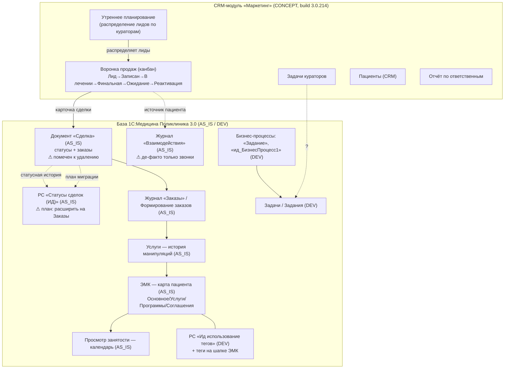

# UI/UX Blueprint — МИС «Институт Движения» (1С:Медицина. Поликлиника, ред. 3.0) + CRM-модуль «Маркетинг»

> **Тип документа:** Enterprise UI/UX & System Analysis Blueprint
> **Метод:** реверс-инжиниринг по визуальным источникам (скриншоты) + аннотации автора в именах файлов
> **Дата сборки:** 26.05.2026
> **Аналитик:** senior product designer / UX-архитектор / системный аналитик 1С

---

## ⚠️ ПРЕДУПРЕЖДЕНИЕ О ПОЛНОТЕ ИСТОЧНИКОВ (читать первым)

| Источник | Статус | Влияние на blueprint |
|---|---|---|
| 20 скриншотов | ✅ Доступны | Основа всего документа (VISUAL PRIORITY) |
| Аннотации в именах файлов (`AS_IS` / `DEV` / `CONCEPT` + комментарии автора) | ✅ Доступны | Ключевой контекст зрелости и намерений |
| Репозиторий `github.com/bitdenvic-sudo/CRM_in_1C` | ❌ **НЕДОСТУПЕН** (HTTP 404 на `main`/`master`/`HEAD`; приватный либо удалён, доступа нет) | **FUNCTIONAL PRIORITY-источник отсутствует** |

**Последствие для STRICT MODE.** В техническом задании репозиторий назначен *главным* источником функционала. Он недоступен. Поэтому:
- весь **функционал ниже выведен исключительно из UI** и помечен преимущественно **LOW/MEDIUM**;
- ни одна бизнес-логика, обработчик, роль или маршрут **не подтверждены кодом**;
- утверждения вида «здесь срабатывает X» — это **наблюдаемое поведение интерфейса**, а не верифицированная логика.

> Чтобы поднять уверенность с LOW до HIGH по функционалу — необходим доступ к репозиторию (см. раздел 8, Critical #1).

**Легенда уверенности и статусов**

- `HIGH` — видно буквально на скриншоте.
- `MEDIUM` — обоснованный вывод из нескольких UI-признаков.
- `LOW` — вывод без кода / косвенно.
- `[ПОДТВЕРЖДЕНО]` `[ПРЕДПОЛОЖЕНИЕ]` `[КОНФЛИКТ]` `[НЕТ ДАННЫХ]`
- `AS_IS` — текущая рабочая система · `DEV` — прототип в разработке · `CONCEPT` — концепт/демо (по словам автора частично «фантазия»).

---

# 1. Executive Summary

**Что это за система.** Медицинская информационная система (МИС) клиники «Институт Движения», построенная на типовой конфигурации **1С:Медицина. Поликлиника, редакция 3.0**. Title bar: `[КОПИЯ] МИС ИНСТИТУТ ДВИЖЕНИЯ ОТ 04.03.25 / Медицина. Поликлиника, редакция 3.0`. `HIGH` `[ПОДТВЕРЖДЕНО]` (Img 4, 11, 12, 17, 18, 19).

**Назначение.** Учёт пациентов, медкарт (ЭМК), услуг, заказов и оплат, планирование загрузки кабинетов/врачей, а также **CRM-надстройка** для управления продажами (сделки, воронка, кураторы, утреннее распределение лидов, теги, бизнес-процессы/задачи).

**Ключевое наблюдение — система существует в трёх «слоях зрелости»:**

1. **AS_IS (база 1С, стандартный интерфейс «Такси»)** — реально работающие объекты: `Сделка`, `Взаимодействия`, `Заказы`, `ЭМК`, `Услуги`, `Просмотр занятости`. `HIGH`.
2. **DEV (прототипы в базе 1С)** — бизнес-процессы (`Задание`, `ид_БизнесПроцесс1`), `Задачи`/`Задания`, подсистема **тегов** (`Ид использование тегов`, теги на шапке ЭМК). `HIGH` визуально, назначение `MEDIUM`.
3. **CONCEPT (отдельный брендированный CRM-модуль «Маркетинг», build 3.0.214)** — собственный UI с жёлтой шапкой «Институт Движения», воронка-канбан и экран «Утреннее планирование». Footer: `База: ИнститутДвижения_Prod · Сервер: srv-1cm-01.id.local`. Автор сам помечает счётчики как «фантазию», а стадии воронки — как «демо». `HIGH` визуально.

**Уровень зрелости UI.**
- AS_IS-формы: зрелые, но **перегруженные** и местами легаси (формы 1С:Медицина, плотные таблицы, двухстрочные шапки). `MEDIUM`.
- DEV: технические/служебные, без продуктового UX. `MEDIUM`.
- CONCEPT (CRM «Маркетинг»): **самый продуктовый и аккуратный** слой (канбан, чипы, drag-and-drop, KPI-карточки), но функционально незаверщён (счётчики/стадии — placeholder). `MEDIUM`.

**Качество документации.** Низкое/фрагментарное. Главный функциональный источник (репозиторий) недоступен. Самая ценная «документация» — это **комментарии автора прямо в именах файлов** скриншотов (что и описывает 3 слоя выше). `[КОНФЛИКТ]` между текстовой и визуальной частью невозможно проверить — нет текстовой документации.

**Основные риски (топ-5).**
1. **Архитектурный разворот не завершён:** объект `Сделка` (документ) и связанные отчёты помечены к удалению, а регистр статусов планируется расширить на `Заказы` (Img 20, аннотация). Двойная модель «сделок» сосуществует. `[КОНФЛИКТ]` `HIGH`.
2. **CRM-модуль частично декоративен** (счётчики «фантазия», стадии «демо») — риск принять прототип за готовый продукт. `HIGH`.
3. **`Взаимодействия` недоиспользуются** — «фактически оседают только телефонные звонки» (аннотация Img 1), при этом CRM претендует на омниканальность (источники: звонок/реклама/сайт/рекомендация/WhatsApp). `[КОНФЛИКТ]` `MEDIUM`.
4. **Отсутствие подтверждения логикой** — все маршруты/правила выведены из UI. `HIGH`.
5. **Разъезд двух дизайн-языков** (типовой 1С vs кастомный «ИД») без единой дизайн-системы. `MEDIUM`.

---

# 2. System Map

> Диаграмма подсистем, объектов и маршрутов. Связи помечены уровнем уверенности.

**Точки входа в систему** (`HIGH`, Img 4/6/8):
- **CRM «Маркетинг»** → стартовые вкладки `Сделки` / `Воронка продаж` / `Утреннее планирование` / `Задачи кураторов`.
- **База МИС** → `Начальная страница` → `Просмотр занятости` (рабочее место регистратора/планирования).
- **ЭМК** → карточка пациента (вкладки `Основное` … `Объединение пациентов`).

**Жизненные циклы объектов** (см. детально в §4):
- **Сделка:** `Сделано предложение → Оплачена частично → Оплачена полностью → Завершена` | ветка `Отказ`. `HIGH` (Img 16, 17, 19). Тип: `Первичная`/`Повторная` (Img 18, 9).
- **Воронка (CONCEPT/демо):** `Лид → Записан → В лечении → Финальная → Ожидание → Реактивация`. `HIGH` визуально, но `[ПРЕДПОЛОЖЕНИЕ]` что это рабочие стадии — автор пишет «стадии демо вида».
- **Задание (БП):** `Старт → Выполнить(Исполнитель) → Нужна проверка? → Проверить(Проверяющий) → Вернуть исполнителю? → Финиш`. `HIGH` (Img 2, 5).

**Основные сущности 1С** (`HIGH`, Img 11, 12, 20):
- Документы: `Сделка`, `Заказ`, документы пациента, `Чеки ККМ`.
- Журналы документов: `Взаимодействия`, `Документы пациента`, `Заказы`, `История данных пациента`, `История мед карты`, `Согласия на ОПД`.
- Справочники: `Причины отказа от сделки`, `Роли партнёров в сделках и проектах`.
- Регистры сведений: `Статусы сделок (ИД)`, `Ид использование тегов`.
- Регистры накопления: `Бонусные баллы`, `Выручка от реализации`, `Денежные средства (…)`, `Квоты`, `Квоты рабочих мест`, `Подарочные сертификаты`, `Прикреплённый контингент соглашений`, `Расход медицинских материалов`, `Расчёты по эквайрингу`, `Расчёты с клиентами` и др.
- Бизнес-процессы: `Задание`, `ид_БизнесПроцесс1`, `Согласование назначений МД`, `Согласование редактирования МД`. Задачи: `Задача`.
- Отчёты: `Сделки`, `Сделки (по периодам)`, `Сделки (реестр)`, `Сделки по причинам отказа`.

> Префикс `ид_` / суффикс `(ИД)` — маркер кастомных объектов «Института Движения» поверх типовой конфигурации. `MEDIUM` `[ПРЕДПОЛОЖЕНИЕ]`.

---

# 3. User Roles

> Роли выведены из подписей пользователей, состава меню и контекста. Без кода — **`LOW`/`MEDIUM`**, кроме явно подписанных.

| Роль | Источник | Задачи (наблюдаемые) | Доступные формы | Ограничения / примечания |
|---|---|---|---|---|
| **РОП** (рук. отдела продаж) | `Васильев С.И. — РОП`, Img 8 `HIGH` | Распределение лидов, контроль воронки, уведомление кураторов, «Авто-распределить» | CRM: Воронка, Утреннее планирование, Задачи кураторов, Отчёт по ответственным | Видит сводные KPI (счётчики — placeholder) |
| **Куратор** | карточки кураторов: Аникина, Романова, Горбунов, Img 8/9 `HIGH` | Ведение закреплённых пациентов/сделок, дожим | CRM-карточки сделок, Задачи кураторов | По 5 пациентов на карточке (демо-данные) `LOW` |
| **Регистратор / администратор** | «Просмотр занятости», «Регистрация телефонных звонков», «Новое взаимодействие», Img 6 `HIGH` | Планирование загрузки, запись, регистрация звонков, заведение взаимодействий | Просмотр занятости, Взаимодействия, Формирование заказов | Работа по филиалам (вкладки ИД/Клин/Краснокамск/МЦ Столица) |
| **Врач / Исполнитель** | «Исполнитель» в БП, исполнитель услуг, Img 2/5/7 `MEDIUM` | Выполнение услуг/задач, меддокументы | ЭМК, Услуги, БП-задачи | Роль `Исполнитель` в маршруте «Задание» |
| **Проверяющий** | роль в маршруте БП, Img 2/5 `HIGH` | Проверка результата, возврат на доработку | БП-задачи (точка «Проверить») | — |
| **Технический специалист / разработчик** | «Функции для технического специалиста», Designer-дерево, Img 11/12/20 `HIGH` | Конфигурирование, доступ к объектам метаданных | Конфигуратор, служебные функции | Полный доступ |
| **Ответственный по сделке** | поле «Ответственный» в сделках/статусах, Img 17/18/19 `HIGH` | Ведение сделки, фиксация статусов | Документ «Сделка», список сделок | Множество ФИО (Суворова, Гаджиева, Мейснер…) |

`[НЕТ ДАННЫХ]`: матрица прав/ролей RLS, разграничение по филиалам, профили доступа — **только из конфигурации/кода** (недоступно).

---

# 4. UI Inventory

> Для каждой формы: назначение · объект 1С · источник · layout · элементы · действия · навигация · сценарии · UX-проблемы · предположения · уверенность.
> Нумерация Img соответствует порядку изображений во вводных данных.

---

## 4.1 Воронка продаж (CRM-канбан)
**Назначение.** Управление пайплайном пациентов/сделок по стадиям. `MEDIUM`
**Связанный объект 1С.** `[ПРЕДПОЛОЖЕНИЕ]` агрегирует `Сделка` + `Заказы`; «Σ Воронки (акт. заказы)». `LOW` (нет кода).
**Источник.** Img 9 · `Представление_воронки … (CONCEPT)`. Автор: «стадии демо вида, за настоящими нужно идти в CJM».
**Layout.** Брендированная шапка → панель действий → ряды фильтров-чипов → горизонтальный канбан из 6 колонок → футеры колонок с суммами.
**Основные элементы.**
- Колонки-стадии: `Лид (3)` · `Записан (4)` · `В лечении (5)` · `Финальная (8)` · `Ожидание (1)` · `Реактивация (1)`.
- Карточка: ФИО, источник+дата (реклама/сайт/звонок/WhatsApp/рекомендация), «к оплате X ₽», счётчик заказов (`1/2 заказа`), сумма, чипы (`первичный`/`повторный`, тип ведения, психотип, `день 0/3/7`), куратор.
- Фильтры-чипы: `ТИП ВЕДЕНИЯ` (контрольный визит / поддерживающее лечение / контроль диагностики / комбинированное), `ГЕОГРАФИЯ` (местный/иногородний), `ПСИХОТИП` (экономный/тревожный/решительный/исследователь), `ДОЖИМ` (день 0/3/7/эскалация).
- Заголовок-сводка: `Σ Воронки (акт. заказы): 179 700,00 ₽ · 22 из 22 пациентов`.
**Действия.** `Создать сделку`, `Обновить`, фильтр `Куратор`, `Тип`, `Сбросить`. `HIGH`
**Навигация.** Карточка → (предположительно) документ «Сделка». `LOW`
**Сценарии.** РОП/куратор отслеживает пациента по стадиям, фильтрует по психотипу/дожиму, дожимает.
**UX-проблемы.** Стадии не подтверждены как боевые (демо); много чипов на карточке → визуальный шум; пересечение «стадия воронки» vs «статус сделки» (две разные модели статусов). `[КОНФЛИКТ]`
**Предположения.** Перетаскивание карточек между колонками меняет стадию — `[ПРЕДПОЛОЖЕНИЕ]` `LOW`.
**Уверенность.** Визуал `HIGH`, функционал `LOW`.

---

## 4.2 Утреннее планирование (распределение лидов)
**Назначение.** Утреннее распределение нераспределённых пациентов по кураторам. `MEDIUM`
**Связанный объект 1С.** `[НЕТ ДАННЫХ]`. Вероятно служебная обработка CRM-модуля. `LOW`
**Источник.** Img 8 · `…утренним планированием … счетчики являются в целом фантазией (CONCEPT)`.
**Layout.** Шапка → панель действий → ряд из 4 KPI-карточек → 2 колонки: слева «Нераспределённые пациенты», справа карточки кураторов.
**Основные элементы.**
- KPI: `АКТИВНЫХ 13` · `БЕЗ КУРАТОРА 7` · `ФИНАЛЬНЫХ 8` · `КУРАТОРОВ 3` — **аннотация: «фантазия» (placeholder)**.
- Чипы пациентов с источником (звонок/реклама/сайт/рекомендация), `drag&drop`.
- Карточки кураторов с закреплёнными пациентами (по 5).
**Действия.** `Авто-распределить`, `Сбросить`, `Уведомить кураторов`, `Журнал`. `HIGH`
**Навигация.** Внутри CRM-модуля (вкладка). 
**Сценарии.** РОП утром: «Авто-распределить» либо вручную перетаскивает лиды на кураторов → «Уведомить кураторов».
**UX-проблемы.** KPI декоративны (риск ложного доверия); нет видимых критериев авто-распределения.
**Предположения.** Авто-распределение по нагрузке/гео/психотипу — `[ПРЕДПОЛОЖЕНИЕ]` `LOW`.
**Уверенность.** Визуал `HIGH`, функционал `LOW`.

---

## 4.3 Документ «Сделка»
**Назначение.** Ядро CRM-учёта: коммерческая сделка с пациентом, связь с заказами и оплатами. `HIGH`
**Связанный объект 1С.** Документ `Сделка` (Img 20: «Сделка (Документы)»). `HIGH` `[ПОДТВЕРЖДЕНО]`
**Источник.** Img 18 · `Документ_сделка (AS_IS)`.
**Layout.** Шапка с реквизитами (2 колонки) → блок «Данные направления» → блок «Показатели» → вкладка «Заказы» с двумя таблицами (заказы / номенклатура).
**Основные элементы / реквизиты.** `Номер`, `Дата`, `Пациент`, `Статус` (Завершена), `Тип сделки` (Повторная), `Дата оплаты`, `Дата следующего контакта`, `Приоритет` (A/B/C), `Цена назначения`, переключатель источника (`Внутренний врач`/`Внешний врач`/`Прочее`), `Направивший внутренний врач`, `Ответственный`, `Комментарий`. Показатели: `Цена сделки`, `Сумма оплачено`, `Сумма к оплате`, `Сумма отменено`, `Остаток услуг`. `HIGH`
**Таблица «Заказы».** Заказ, Пациент, Медкарта, Количество, Сумма, Оплачено + правая таблица номенклатуры (Кол-во/Сумма/Оплачено/Выполнена/Отменена).
**Действия.** `Записать и закрыть`, `Записать`, `Оформить отказ`, `Позвонить`, `Идентификация заказов`, `Отменить заказ`, `Отвязать заказ`. `HIGH`
**Навигация.** Из списка «Сделки» / воронки; → связанные «Заказы».
**Сценарии.** Создание сделки на пациента → привязка заказов → фиксация оплаты → закрытие/отказ.
**UX-проблемы.** Плотная форма; два уровня таблиц; ручная привязка/отвязка заказов; **объект помечен к удалению из концепта** (Img 20) → конфликт с воронкой.
**Предположения.** Статус выставляется вручную через выпадающий список (Img 16). `MEDIUM`
**Уверенность.** `HIGH`.

---

## 4.4 Список «Сделки»
**Назначение.** Реестр всех сделок с фильтрами и цветовой индикацией статусов. `HIGH`
**Связанный объект 1С.** Форма списка документа `Сделка`. `HIGH`
**Источник.** Img 19 · `Список_сделок (AS_IS)`.
**Layout.** Панель фильтров (`Ответственный`, `Дата ≥`) → таблица.
**Колонки.** Номер, Дата, Пациент, Цена сделки, Дата оплаты (план.), Дата след. контакта, Ответственный, Комментарий, Статус сделки, Приоритет. `HIGH`
**Цветовая индикация статусов.** `Отказ`, `Завершена` (зелёный), `Оплачена полностью` (розовый), `Оплачена частично` (жёлтый). `HIGH`
**Действия.** `Создать`, фильтрация. `HIGH`
**Сценарии.** Поиск и отбор сделок ответственным/датой; быстрый визуальный статус-скан.
**UX-проблемы.** Соседствуют старые (2018) и новые (2025/26) записи; нет видимой группировки по стадии/куратору.
**Уверенность.** `HIGH`.

---

## 4.5 РС «Статусы сделок (ИД)»
**Назначение.** История смены статусов сделок (audit-trail статусов). `HIGH`
**Связанный объект 1С.** Регистр сведений `Статусы сделок (ИД)` (Img 20). `HIGH` `[ПОДТВЕРЖДЕНО]`
**Источник.** Img 17 · `Статусы_сделок (AS_IS)`.
**Layout.** Кнопка `Создать` → таблица записей.
**Колонки.** Период, Программа (`Сделка 000-008xxxx от …`), Статус (Сделано предложение / Оплачена частично / Оплачена полностью), Ответственный. `HIGH`
**Сценарии.** Хронология изменения статуса по каждой сделке (несколько записей за минуты — фиксация переходов).
**UX-проблемы.** Поле названо «Программа», но содержит ссылку на «Сделка» → терминологическая неоднозначность. `[ПРЕДПОЛОЖЕНИЕ]`
**Важно (план миграции).** Аннотация Img 20: регистр **будет применён также для `Заказы`** → станет универсальным статус-логом. `[КОНФЛИКТ]`/план.
**Уверенность.** `HIGH`.

---

## 4.6 Перечень статусов сделки (выпадающий список)
**Назначение.** Набор возможных статусов сделки. `HIGH`
**Связанный объект 1С.** `[ПРЕДПОЛОЖЕНИЕ]` Перечисление/Справочник статусов. `MEDIUM`
**Источник.** Img 16 · `Перечень_статусов_сделок (AS_IS)`.
**Значения.** `Сделано предложение` · `Оплачена частично` · `Оплачена полностью` · `Отказ` · `Завершена`. `HIGH`
**UX-проблемы.** Этот набор (5 статусов) **не совпадает** со стадиями воронки (6 стадий) — две независимые модели состояния. `[КОНФЛИКТ]`
**Уверенность.** `HIGH`.

---

## 4.7 Объекты «Сделок» (служебный поиск техспециалиста)
**Назначение.** Инвентаризация объектов вокруг сделок. `HIGH`
**Источник.** Img 20 · `Объекты_для_сделок … будут удалены из концепта … регистр будет применён и для Заказы (AS_IS)`.
**Найденные объекты.** Справочники: `Причины отказа от сделки`, `Роли партнёров в сделках и проектах`. Документ: `Сделка`. Отчёты: `Сделки`, `Сделки (по периодам)`, `Сделки (реестр)`, `Сделки по причинам отказа`. РС: `Статусы сделок (ИД)`. `HIGH`
**План (аннотация автора).** Документ `Сделка` + отчёты — **к удалению**; регистр статусов — **расширить на Заказы**. `HIGH` `[КОНФЛИКТ]`
**Уверенность.** `HIGH`.

---

## 4.8 ЭМК — карта пациента (Основное)
**Назначение.** Центральная карточка пациента. `HIGH`
**Связанный объект 1С.** ЭМК / карта пациента (типовая 1С:Медицина). `HIGH`
**Источник.** Img 14 · `ЭМК (AS_IS)`.
**Layout.** Шапка-баннер (карта/депозит/задолженность) → блок карты → блок демографии/контактов/соц.данных.
**Элементы.** № карты `К-404`, «Сумма депозита», «Сумма задолженности», ФИО, ДР, Возраст, Пол, СНИЛС, Документ, Полисы (ОМС/ДМС), Контакты (несколько телефонов), Соц.статус, `Согласие ПДн до`, `Договор до` (красным — просрочка). `HIGH`
**Вкладки.** `Основное · Новый Заказ · Программы · Услуги · Сетка · Взаимодействия · Соглашения · История персональных данных · История карты пациента · Объединение пациентов`. `HIGH`
**Действия.** `Смена`, `Карта на основании`, `Отправить в архив`, `Идентификация заказа`, `Позвонить`, `Чат бот`, `Оплатить`, `Оформить возврат`, `Печать`. `HIGH`
**Сценарии.** Точка входа в обслуживание пациента; навигация по услугам/заказам/взаимодействиям.
**UX-проблемы.** Высокая плотность; критичные просрочки (`Договор до`) видны только цветом текста; много телефонов без явной приоритезации.
**Уверенность.** `HIGH`.

---

## 4.9 ЭМК с тегами (DEV)
**Назначение.** Отображение тегов-маркеров на шапке карты. `HIGH`
**Связанный объект 1С.** Связка ЭМК ↔ РС `Ид использование тегов`. `MEDIUM`
**Источник.** Img 15 · `ЭМК_с_тегами (DEV)`.
**Элементы.** Ряд бейджей: `Автоматический` (чёрный) · `Shalyapn` (зелёный) · `Иногородний` (серый) · `Клоун` (красный). `HIGH`
**Сценарии.** Быстрая визуальная сегментация пациента (гео, поведение, авто-признаки).
**UX-проблемы.** Цвета бейджей без явной семантической легенды; смесь системных и «шуточных» тегов (`Клоун`) — риск замусоривания. `[ПРЕДПОЛОЖЕНИЕ]`
**Уверенность.** Визуал `HIGH`, механика `MEDIUM`.

---

## 4.10 РС «Ид использование тегов» (DEV)
**Назначение.** Хранение факта присвоения тега субъекту (пациенту). `MEDIUM`
**Связанный объект 1С.** Регистр сведений `Ид использование тегов`. `HIGH`
**Источник.** Img 10 · `Регистры_Сведений_для_тегов (DEV)`.
**Колонки.** Период, Субъект (ФИО), Тег (все «День рождения»), Использование (✓), Ответственный. `HIGH`
**Сценарии.** Массовое проставление тега (один период `22.05.2026 9:34:19` на всех → похоже на пакетную операцию/регламент). `MEDIUM`
**UX-проблемы.** Нет видимого справочника тегов с правилами; «День рождения» как тег ≈ вычислимый признак, но хранится записями.
**Уверенность.** Визуал `HIGH`, назначение `MEDIUM`.

---

## 4.11 Услуги — история манипуляций (ЭМК)
**Назначение.** Полная история медуслуг пациента. `HIGH`
**Связанный объект 1С.** Список услуг ЭМК (типовая). `HIGH`
**Источник.** Img 7 · `Перечень_услуг_в_ЭМК (AS_IS)`.
**Layout.** Панель команд → широкая таблица (розовая заливка), двухстрочные шапки колонок.
**Колонки.** Статус услуги / Статус согласования, Арт., Номенклатура, Кол-во, Кабинет/Исполнитель, Дата/Время, Сумма/`% авт.`, Ист.фин./Бонусами, Соглашение/`% руч.`/Сумма руч., Назначение/Сотрудник, Комментарий. `HIGH`
**Статусы услуг.** `На оплату`, `Заказана`. `HIGH`
**Действия.** `Информация`, `Редактирование`, `Заказ`, `Открыть МД`, обновить, поиск, `Печать`, `Настроить список`, `Идентификация заказов`. `HIGH`
**UX-проблемы.** Очень высокая плотность; цвет-кодирование статусов через заливку строк (без легенды); двухуровневые шапки усложняют чтение.
**Уверенность.** `HIGH`.

---

## 4.12 Формирование заказов (Новый Заказ)
**Назначение.** Создание заказа из ЭМК с подбором номенклатуры/прайса. `HIGH`
**Связанный объект 1С.** Документ `Заказ` (типовая). `HIGH`
**Источник.** Img 13 · `Формирование_нового_заказа … подхватываются назначенные но не привязанные к Заказам Услуги (AS_IS)`.
**Layout.** Слева — табличная часть заказа; справа — подборщик номенклатуры с прайсом и фильтрами.
**Элементы.** Строки заказа: Арт./CITO, Номенклатура/Соглашение, Рабочее место, Дата/Время, Цена, Кол-во, Сумма, Комментарий. Подборщик: `Ист.фин.` (Средства пациента), `Соглашение` (Платные услуги ИД), `Рабочие места`, `Фильтр по группе`, поиск по Артикул/Наименование, прайс-таблица.
**Действия.** `Провести`, `Печать`, `Варианты оплаты`, `Оплатить`, `Планирование`, `Направление`, `Ист. фин.`, `N раз`, `Скидки`, `Сделка`, `Виды ЛФК`, `Создать на основании`. `HIGH`
**Ключевое поведение.** В заказ **подхватываются назначенные, но не привязанные к заказам услуги** (аннотация). `HIGH` `[ПОДТВЕРЖДЕНО автором]`
**UX-проблемы.** Очень много команд в одной панели; двухпанельный подбор требует контекста; кнопка `Сделка` связывает заказ со сделкой (точка пересечения моделей).
**Уверенность.** `HIGH`.

---

## 4.13 Просмотр занятости (календарь планирования)
**Назначение.** Рабочее место планирования загрузки кабинетов/оборудования/врачей. `HIGH`
**Связанный объект 1С.** Просмотр занятости (типовая). `HIGH`
**Источник.** Img 6 · `Начальный_экран_с_календарем_планирования (AS_IS)`.
**Layout.** Панель управления (дата, режим «День», действия) → фильтры → вкладки филиалов → сетка время×ресурс.
**Элементы.** Колонки-ресурсы: `Анализы`, `BTL1 (Ультразвук/Фонофорез)`, `BTL2 (Магнитотерапия/ЭКГ)`, `BTL3 (Лазеротерапия/Электротерапия)`, `HILT`, `SIS`, `УВТ BTL`, врачи. Ячейки: зелёные (запись с ФИО), красные `Занято другим РМ`, серые `Проветривание`. `HIGH`
**Фильтры.** Спец./Долж., Сотрудник, МВ, Возр. огр., Смена. Вкладки филиалов: `Институт движения · Клин · Краснокамск · МЦ Столица`. `HIGH`
**Действия.** `Регистрация телефонных звонков`, `Новое взаимодействие`, `Графики работы`, `Интервалы`, навигация по дням. `HIGH`
**Сценарии.** Регистратор подбирает свободный слот, фиксирует запись/звонок/взаимодействие.
**UX-проблемы.** Очень высокая плотность; `Занято другим РМ` повторяется массово (шум); легенда цветов неочевидна новичку.
**Уверенность.** `HIGH`.

---

## 4.14 Журнал «Взаимодействия»
**Назначение.** История касаний с пациентом (по факту — журнал звонков). `HIGH`
**Связанный объект 1С.** Журнал документов `Взаимодействия`. `HIGH`
**Источник.** Img 1 · `Взаимодействия … фактически здесь сейчас оседают телефонные звонки только (AS_IS)`.
**Layout.** Фильтры (Режим, Ответственный, Вид) → таблица.
**Колонки.** Дата, Контакт, Абонент, Как связаться (тел.), Вид (`Запись на приём`/`Перезапись на приём`/`Обращение без записи`), Предмет (`Заказ ИДМП-…`/`Перезапись`/`Взаимодействие`/`Другое`), Медицинское рабочее место, Запланированное время, Ответственный. `HIGH`
**Действия.** `Найти`, `Отменить поиск`. `HIGH`
**UX-проблемы.** **Недоиспользование** — по словам автора, фиксируются только звонки, тогда как CRM претендует на омниканальность (сайт/реклама/WhatsApp/рекомендация). `[КОНФЛИКТ]`
**Уверенность.** Визуал `HIGH`, оценка использования `MEDIUM` (со слов автора).

---

## 4.15 Карта маршрута бизнес-процесса «Задание» (конструктор)
**Назначение.** Маршрут типового БП «Задание» (поручение → проверка). `HIGH`
**Связанный объект 1С.** Бизнес-процесс `Задание` (Img 12). `HIGH`
**Источник.** Img 5 · `Конструктор_Бизнес_процесса (DEV)`; Img 2 — он же с модалкой задач.
**Layout.** Поля шапки (Бизнес-процесс / Автор / Дата / состояние «Не стартован, активен») → канвас блок-схемы.
**Маршрут.** `Старт → [Исполнитель] Выполнить → ⬡ Нужна проверка? (Да/Нет) → [Проверяющий] Проверить → ⬡ Вернуть исполнителю? (Да/Нет) → Финиш`. Заметки: оценка исполнителя (выполнено/отменено), оценка проверяющего (выполнено/отменено/возвращено). `HIGH`
**Действия.** `Показать задачи для точки маршрута`, печать. `HIGH`
**Уверенность.** `HIGH` (типовой механизм 1С).

---

## 4.16 Задачи по точке маршрута (модальное окно)
**Назначение.** Список задач конкретной точки маршрута. `HIGH`
**Источник.** Img 2 · `Возникающие_задачи_при_прохождении_Бизнес_процесса (DEV)`.
**Элементы.** Заголовок (Бизнес-процесс, Точка маршрута: `Проверить`). Колонки: Задача, Записана, Исполнитель, Автор, Номер, Срок, Выполнена.
**Действия.** `К исполнению`, `Перенаправить`, `Позвонить`, `Создать на основании`. `HIGH`
**Уверенность.** `HIGH`.

---

## 4.17 Задачи (древовидное представление)
**Назначение.** Сводный список задач по бизнес-процессам. `HIGH`
**Связанный объект 1С.** `Задача` (Img 12). `HIGH`
**Источник.** Img 4 · `Задачи_в_представлении_дереве (DEV)`.
**Layout.** Фильтры (Бизнес-процесс, Точка маршрута, Показывать=Все задачи, Автор, Исполнитель) → дерево.
**Колонки.** Задача, Записана, Исполнитель, Автор, Номер, Срок, Выполнена. `HIGH`
**Данные.** Точки `Взять в работу` (Срок не указан), `Тестовое задание`/Администратор (2018), `Тратататататааа` (МП-…), исполнитель `HTTP`. `HIGH`
**Действия.** `К исполнению`, `Перенаправить`, `Позвонить`, `Создать на основании`. `HIGH`
**UX-проблемы.** Тестовые данные («Тратататататааа»), исполнитель `HTTP` (служебный) — прототип.
**Уверенность.** Визуал `HIGH`, продуктовая роль `MEDIUM`.

---

## 4.18 Задания (список экземпляров БП)
**Назначение.** Реестр запущенных заданий-БП. `HIGH`
**Источник.** Img 3 · `Задания (DEV)`.
**Layout.** Фильтры (Автор, Исполнитель) + чекбоксы (Показывать завершённые/остановленные) → таблица.
**Колонки.** Номер (`МП-00000001…`), Дата, Задание (`Без описания`), Срок исполнения, Завершено. `HIGH`
**Действия.** `Создать`, `Задачи`, `Остановить`, `Продолжить`, поиск. `HIGH`
**UX-проблемы.** «Без описания» у всех заданий — нет обязательного именования.
**Уверенность.** `HIGH`.

---

## 4.19 Структура конфигурации (Designer-дерево)
**Назначение.** Карта метаданных (служебный источник архитектуры). `HIGH`
**Источник.** Img 11 + Img 12 · `Структура_Конфигурации … (AS_IS)`. (Перечень объектов сведён в §2.)
**Аннотации автора.** «активно используемые элементы» (Img 11) и «используются только некоторые из представленных сущностей (из регистра накоплений)» (Img 12) — т.е. часть регистров накопления **не задействована**. `[ПРЕДПОЛОЖЕНИЕ автора]`
**Уверенность.** Перечень объектов `HIGH`; фактическая используемость `MEDIUM` (со слов автора).

---

# 5. UX Flows

> Пошаговые сценарии. Без кода переходы помечены `MEDIUM`/`LOW`.

**Flow A — Лид → Сделка (CRM, целевой).** `MEDIUM`
1. Лид попадает в «Утреннее планирование» (источник: звонок/реклама/сайт/…). 2. РОП «Авто-распределить» либо drag&drop → куратор. 3. «Уведомить кураторов». 4. Куратор ведёт пациента по воронке (Лид→Записан→В лечении→…). 5. Создаётся «Сделка», привязываются «Заказы». 6. Статусы сделки фиксируются в РС «Статусы сделок (ИД)».
> Слабое место: стадии воронки (демо) ≠ статусы сделки (5 шт.) → две несинхронные модели. `[КОНФЛИКТ]`

**Flow B — Запись пациента (регистратура, AS_IS).** `HIGH`
1. «Просмотр занятости» → выбор филиала/ресурса/слота. 2. «Регистрация телефонных звонков» / «Новое взаимодействие». 3. Запись → создаётся «Взаимодействие» (вид «Запись на приём»). 4. Из ЭМК «Новый Заказ» → подбор номенклатуры → «Провести»/«Оплатить».

**Flow C — Заказ из ЭМК (AS_IS).** `HIGH`
1. ЭМК → вкладка «Новый Заказ». 2. Подбор услуг (подхватываются назначенные, но не привязанные). 3. Ист.фин./Соглашение/Скидки. 4. «Сделка» (привязка) → «Провести» → «Оплатить».

**Flow D — БП «Задание» (DEV).** `HIGH`
1. Создать «Задание» → старт. 2. Исполнитель «Выполнить» → «К исполнению». 3. «Нужна проверка?» → Проверяющий «Проверить». 4. «Вернуть исполнителю?» (да → доработка / нет → финиш).

**Flow E — Тегирование пациента (DEV).** `MEDIUM`
1. (Пакетно/вручную) запись в РС «Ид использование тегов». 2. Тег отображается бейджем на шапке ЭМК.

---

# 6. Design System (извлечённые паттерны)

**Два дизайн-языка (главный паттерн).** `HIGH`
- **Типовой 1С «Такси»** (AS_IS/DEV): серые таблицы, синие гиперссылки, жёлтый акцент-кнопка, двухстрочные шапки, плотные панели команд.
- **Кастомный «ИД» (CRM «Маркетинг», CONCEPT):** жёлтая брендированная шапка, белые карточки, чипы/бейджи, канбан-колонки, KPI-карточки, drag&drop, фиолетовые/цветные аватары-инициалы кураторов.

**Цвет как носитель статуса (сквозной паттерн).** `HIGH`
- Зелёный = выполнено/занято слотом/завершено. Розовый = оплачено полностью. Жёлтый = частично/выбрано. Красный = отказ/занято другим РМ/просрочка. Серый = проветривание/неактивно.
> Риск: семантика цвета **нигде не легендирована** → высокий порог входа.

**Чипы и бейджи.** Источник лида, психотип, тип ведения, дожим (CRM); теги пациента на ЭМК. Пилюли с цветовой заливкой. `HIGH`

**Команды-паттерны (повторяемые).** `Создать`, `Создать на основании`, `Позвонить`, `Печать`, `Идентификация заказов`, `К исполнению`, `Перенаправить`, фильтры `Ответственный`/`Дата`. `HIGH`

**Модальные окна.** Стандартная модалка 1С (задачи по точке маршрута, Img 2). `HIGH`

**KPI-карточки.** Числовые сводки в шапке (CRM) — но в текущем виде **placeholder** («фантазия»). `HIGH`

**Паттерны ошибок/уведомлений.** `[НЕТ ДАННЫХ]` — на скриншотах не зафиксированы (видны лишь нотификации Windows об активации, не относящиеся к продукту).

---

# 7. Gaps & Conflicts

| # | Проблема | Источник | Влияние | Риск | Рекомендация |
|---|---|---|---|---|---|
| G1 | **Репозиторий недоступен** (404) — нет функционального источника | Попытка клонирования | Весь функционал не верифицирован кодом | **Critical** | Открыть доступ / выгрузить cf/выгрузку конфигурации |
| G2 | Документ `Сделка` помечен к удалению, регистр статусов — расширить на `Заказы` | Img 20 (аннотация) `[КОНФЛИКТ]` | Двойная модель сделок сосуществует | High | Зафиксировать целевую модель до разработки |
| G3 | Стадии воронки = «демо», счётчики = «фантазия» | Img 8, 9 (аннотации) | Прототип можно принять за продукт | High | Подтянуть реальные стадии из CJM, оживить KPI |
| G4 | Воронка (6 стадий) ≠ статусы сделки (5) | Img 9 vs 16 `[КОНФЛИКТ]` | Несинхронные состояния | High | Единая стейт-машина: стадия ↔ статус |
| G5 | `Взаимодействия` де-факто = только звонки | Img 1 (аннотация) `[КОНФЛИКТ]` | Нет омниканальной истории касаний | Medium | Расширить виды/каналы или вынести в CRM |
| G6 | Тесто­вые/мусорные данные в DEV («Тратататататааа», тег «Клоун», исполнитель `HTTP`) | Img 3, 4, 15 | Загрязнение прототипа | Medium | Чистка демо-данных, справочник тегов с правилами |
| G7 | Два дизайн-языка без единой DS | Все Img | Несогласованный UX, высокий порог | Medium | Единые токены/компоненты (чипы, статусы, кнопки) |
| G8 | Цвет-статусы без легенды | Img 6, 7, 19 | Ошибки чтения, обучение | Medium | Легенда + иконки/подписи к цвету |
| G9 | Перегруженные формы (Услуги, Формирование заказов, Просмотр занятости) | Img 7, 13, 6 | Когнитивная нагрузка, ошибки | Medium | Прогрессивное раскрытие, группировка команд |
| G10 | Часть регистров накопления не используется | Img 12 (аннотация) `[ПРЕДПОЛОЖЕНИЕ]` | Технический долг | Low | Аудит используемости, чистка |
| G11 | `Договор до`/`Согласие ПДн` видны только цветом текста | Img 14 | Пропуск критичных просрочек | Medium | Явные бейджи-предупреждения |
| G12 | «Задание» = `Без описания` у всех | Img 3 | Нечитаемый реестр задач | Low | Обязательное/авто-описание |

**Legacy.** Документ `Сделка` + отчёты по сделкам (к удалению), часть неиспользуемых регистров накопления, типовые формы 1С:Медицина с двухстрочными шапками.

**UX debt.** Несинхронные модели статусов (G4), отсутствие DS (G7), цвет без легенды (G8), перегруженные команды (G9), placeholder-KPI (G3).

---

# 8. REQUIRED CLARIFICATIONS

## Critical (без этого нельзя продолжать)

**C1. Доступ к репозиторию / выгрузке конфигурации.**
- *Почему важно:* это назначенный главный источник функционала; сейчас весь функционал — `LOW`.
- *Что неизвестно:* реальные роли, маршруты, обработчики, правила авто-распределения, привязка заказов, стейт-машина сделки.
- *Предположения:* модель восстановлена из UI.
- *Риск ошибки:* высокий — любое архитектурное решение без кода может противоречить реализации.

**C2. Целевая модель «Сделка vs Заказ».**
- *Почему важно:* Img 20 говорит об удалении документа `Сделка` и переносе статусов на `Заказы`.
- *Что неизвестно:* что станет «единицей продажи» — заказ, сделка или агрегат воронки.
- *Предположения:* идёт миграция «документ сделки → статус-лог над заказами».
- *Риск:* проектирование под устаревшую модель.

**C3. Реальные стадии воронки и связь со статусами.**
- *Почему важно:* стадии «демо», «настоящие в CJM».
- *Что неизвестно:* боевой перечень стадий, маппинг стадия↔статус, триггеры переходов.
- *Риск:* несинхронная стейт-машина (G4).

## Important (желательно уточнить)

**I1. Правила «Авто-распределить» (Утреннее планирование).** По каким критериям лиды раскидываются на кураторов (нагрузка/гео/психотип/источник)? Сейчас `[НЕТ ДАННЫХ]`.
**I2. Источник KPI-счётчиков.** Какие из них реальны, какие «фантазия»; формулы расчёта.
**I3. Каналы «Взаимодействий».** Должна ли система собирать сайт/WhatsApp/рекламу, или это остаётся в CRM-слое отдельно (G5).
**I4. Справочник и правила тегов.** Откуда берутся теги (`Автоматический`, `Иногородний`, `День рождения`), их семантика и цветовая легенда.
**I5. Роли и права.** Полная ролевая матрица (RLS, филиалы).

## Optional (можно позже)

**O1.** Печатные формы (состав, шаблоны).
**O2.** Интеграции (ККМ/эквайринг, телефония «Позвонить», «Чат бот»).
**O3.** Состав отчётности («Отчёт по ответственным», отчёты по сделкам).
**O4.** Мультифилиальная специфика (ИД/Клин/Краснокамск/МЦ Столица).

---

# 9. RECOMMENDED NEXT ITERATION

1. **Получить код/выгрузку** и верифицировать §3–§5 (поднять функционал до `HIGH`).
2. **Зафиксировать целевую доменную модель** (Сделка/Заказ/Воронка) и единую стейт-машину «стадия ↔ статус» (закрывает G2, G4).
3. **UX cleanup CRM-модуля:** оживить KPI или убрать placeholder; подтянуть реальные стадии из CJM; почистить демо-данные (G3, G6).
4. **Дизайн-система:** единые токены и компоненты (статус-чип с легендой, кнопки, фильтры, карточки) поверх обоих слоёв (G7, G8).
5. **Нормализация перегруженных форм** (Услуги, Формирование заказов, Просмотр занятости): прогрессивное раскрытие, группировка команд «Ещё», разделение режимов просмотр/редактирование (G9).
6. **Критичные статусы пациента** (Договор/ПДн/задолженность) — вынести в явные предупреждающие бейджи (G11).
7. **Стратегия `Взаимодействий`:** решить — расширять журнал каналами или централизовать историю касаний в CRM (G5).

---

# FINAL REQUIREMENTS (итоговые ответы)

**1. Общая оценка зрелости интерфейса.**
- AS_IS — зрелый, но легаси и перегружен (типовая 1С:Медицина). `MEDIUM`
- DEV — технические прототипы без продуктового UX. `MEDIUM`
- CONCEPT (CRM «Маркетинг») — лучший по UX слой, но функционально незавершён (placeholder). `MEDIUM`
- **Итог: «прототип поверх зрелой базы» — UI готов на ~50–60% как продукт, бэк/логика не верифицированы.** `LOW` (нет кода).

**2. Основные UX-риски.** Несинхронные модели статусов (G4); декоративные KPI/стадии (G3); цвет-статусы без легенды (G8); перегруженные формы (G9); разъезд двух дизайн-языков (G7).

**3. Что критично улучшить.** (а) Получить код и зафиксировать целевую доменную модель Сделка/Заказ (G1, G2). (б) Единая стейт-машина воронка↔статус (G4). (в) Оживить/убрать placeholder в CRM (G3).

**4. Что можно оставить.** Канбан-воронку и «Утреннее планирование» как UX-паттерны (сильные); «Просмотр занятости» как рабочее место регистратора; механизм БП «Задание» (типовой, надёжный); РС «Статусы сделок (ИД)» как основу статус-лога.

**5. Какие данные собрать дополнительно.** Репозиторий/выгрузку конфигурации; правила авто-распределения и KPI; реальные стадии CJM; справочник/правила тегов; ролевую матрицу (см. §8).

**6. Какие формы требуют redesign.** Услуги (4.11), Формирование заказов (4.12), Просмотр занятости (4.13) — перегруженность; шапка ЭМК (4.8) — критичные статусы; CRM-счётчики (4.2) — placeholder.

**7. Какие формы эталонные.** Воронка продаж (4.1) и Утреннее планирование (4.2) — как UX-эталон CRM-слоя; список «Сделки» (4.4) — компактный реестр со статус-цветом; карта маршрута БП (4.15) — чистая типовая схема.

**8. Какие сценарии наиболее рискованные.** Flow A (Лид→Сделка) — из-за несинхронных моделей и миграции `Сделка→Заказ`; тегирование (Flow E) — без справочника правил; любой сценарий, где UI-вывод не подтверждён кодом.

**9. Какие части документации ненадёжны.** Любые функциональные утверждения (репозиторий недоступен); назначение DEV-объектов; «используемость» регистров (со слов автора); всё, помеченное `LOW`/`[ПРЕДПОЛОЖЕНИЕ]`.

**10. Какие данные подтверждены только косвенно.** Роли пользователей (по подписям/меню); связи форм и переходы (по логике UI); принадлежность объектов к кастому по префиксу `ид_`/суффиксу `(ИД)`; «недоиспользование Взаимодействий», «фантазийность» KPI и «демо» стадий — подтверждены **только аннотациями автора в именах файлов**, не кодом.

---

*Конец документа. Все функциональные выводы получены без доступа к исходному коду и подлежат верификации после открытия репозитория (Critical C1).*
