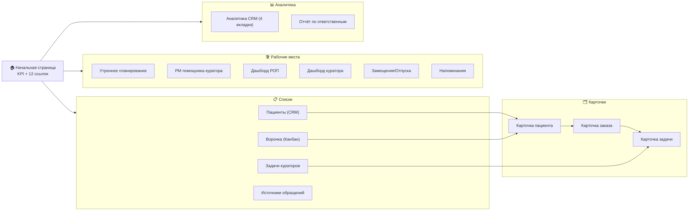
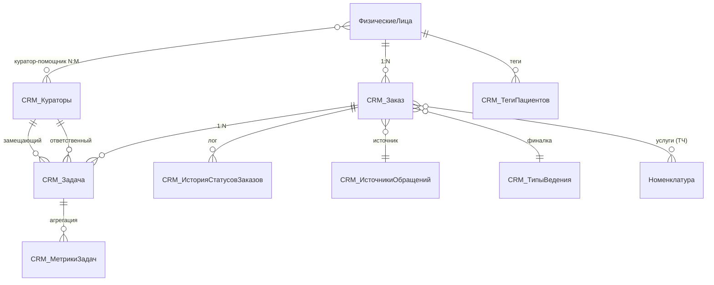
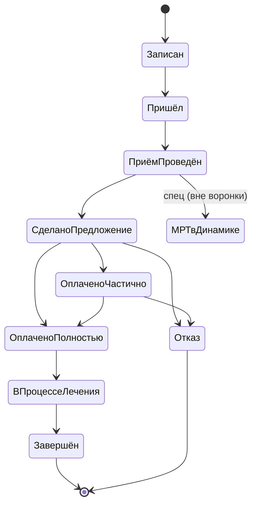
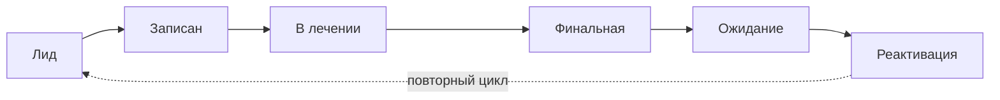
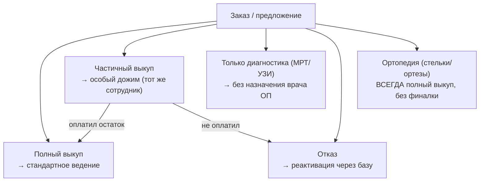
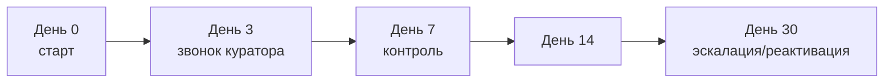
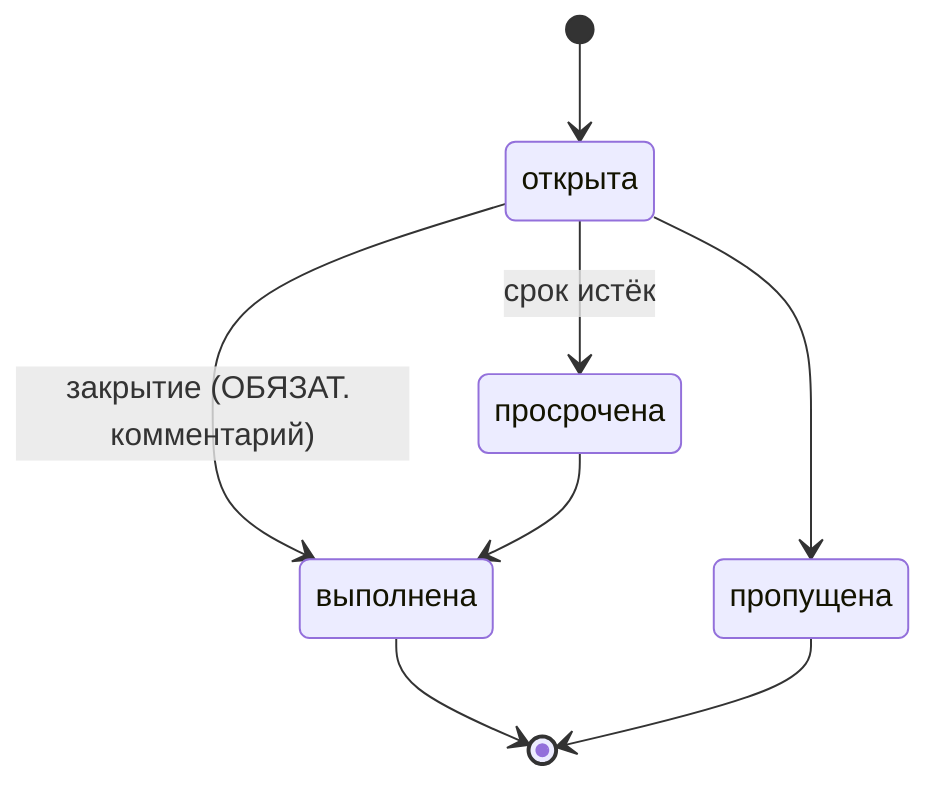
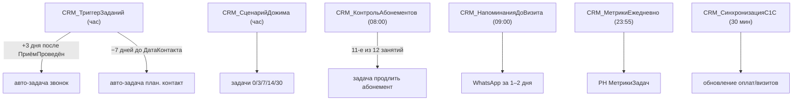
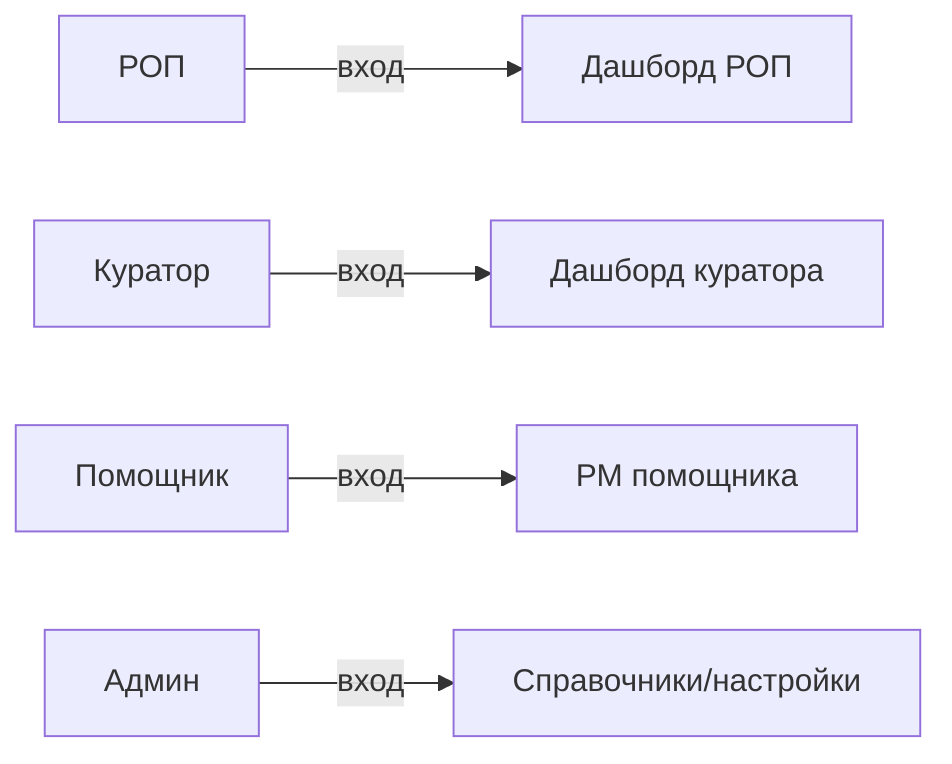

# UI/UX Blueprint v2.0 — CRM «Индвиго» / «Институт Движения»
### Расширение (.cfe) к 1С:Медицина.Поликлиника + CRM-модуль «Маркетинг»

> **Тип:** Enterprise UI/UX & System Analysis Blueprint
> **Версия:** 2.0 (заменяет v1.0, построенный только по 20 скриншотам)
> **Источники v2.0:** репозиторий `bitdenvic-sudo/CRM_in_1C` (доступ открыт) + 20 скриншотов
> **Дата:** 26.05.2026

---

## 0. Что изменилось против v1.0 и легенда

В v1.0 репозиторий был недоступен (404), поэтому функционал был `LOW`, а схем/форм мало. Сейчас доступны: **23 ФТ**, **модель данных** (17 объектов `CRM_*`, 12 перечислений, 6 регистров, 6 регламентных заданий), **HTML-прототип на 16 экранов**, **Figma-blueprint v2**, **CJM**, **14 зафиксированных конфликтов**, протоколы **10 встреч**. Это позволяет поднять функционал до `HIGH`/`MEDIUM` и дать полноценные схемы и раскладки форм.

**Три плоскости системы (критично различать):**

| Плоскость | Что это | Источник | Маркер |
|---|---|---|---|
| **AS_IS** | Текущая база 1С:Медицина.Поликлиника с легаси-объектом `Сделка` | Скриншоты 1, 6, 7, 11–20 | реально работает |
| **PROTOTYPE / CONCEPT** | HTML-прототип CRM «Маркетинг» (16 экранов) — целевой UX | `demo app/`, скрин 8, 9 | визуальный таргет, не 1С |
| **TARGET (.cfe)** | Проектируемое расширение: `CRM_Заказ` вместо `Сделка`, 9 статусов | `docs/DATA_MODEL.md`, FR | модель данных, Discovery не начат |

**Ключевой факт зрелости (из README):** Discovery **НЕ начат** (старт 27.05.2026), разработка 1С **НЕ начата**, открыто **28 из 30** OQ. Вся проектная документация самой командой помечена как **гипотеза, не ТЗ**. → Любая модель данных и форма — **TO-BE**, подлежит верификации Discovery.

`HIGH`/`MEDIUM`/`LOW` — уверенность. `[ПОДТВЕРЖДЕНО]` `[ПРЕДПОЛОЖЕНИЕ]` `[КОНФЛИКТ]`.

---

# 1. Executive Summary

**Система.** CRM-модуль для сети клиник «Индвиго» (бренд «Институт Движения», ортопедия/реабилитация). Реализация — **расширение `.cfe`** к типовой 1С:Медицина.Поликлиника на 1С:Предприятие 8.3.25; типовая конфигурация не меняется, все объекты с префиксом `CRM_`. `HIGH` `[ПОДТВЕРЖДЕНО]` (README, DATA_MODEL).

**Назначение.** Автоматизация полного жизненного цикла пациента: от первичного обращения через воронку заказов (9 статусов), ведение кураторами, дожим (0-3-7-14-30), ABC-сегментацию, абонементы, замещения, до дашбордов РОП/куратора и аналитики LTV.

**Уровень зрелости.**
- Доказательная база (10 MoM, FR, data-model, прототип) — **ВЫСОКАЯ**. `HIGH`
- Проектная документация (`docs/`) — **НИЗКАЯ** (сама помечена «гипотезы»; Discovery не начат). `HIGH`
- UI: HTML-прототип покрывает **17 из 23 FR (74%)** полностью, 5 частично. `HIGH`
- Реализация в 1С — **0%** (не начата).

**Главные риски (топ-6):**
1. **Discovery не проведён** → AS-IS неизвестен, вся модель — гипотеза (C-01). `HIGH`
2. **Финансовый разрыв 4–10×:** бюджет ~765 000 ₽ против оценки ~2 167 ч (≈3.25–6.5 млн ₽) (C-07). `HIGH`
3. **Две модели состояния:** 6 стадий пациента (канбан) ≠ 9 статусов заказа (C-08, FR-003). `HIGH`
4. **Легаси `Сделка` → `CRM_Заказ`:** миграция термина не завершена в params/ (C-06). `HIGH`
5. **28/30 OQ открыты**, в т.ч. архитектура интеграции OQ-005 (одна база vs HTTP) — просрочена. `HIGH`
6. **Конфликты внутри docs/** (14 шт., 2 критических) — модель не консистентна. `HIGH`

---

# 2. System Map

## 2.1 Архитектура (3 плоскости)

```mermaid
flowchart TB
    subgraph EXT["Расширение CRM (.cfe) — TARGET"]
        direction TB
        DocOrder["Документ CRM_Заказ\n(ядро: 9 статусов, услуги, финалка)"]
        DocTask["Документ CRM_Задача\n(дожим/триггеры/абонемент)"]
        RefCur["Справочник CRM_Кураторы"]
        RefSrc["Справочник CRM_ИсточникиОбращений"]
        RefVed["Справочник CRM_ТипыВедения"]
        Enums["12 перечислений\n(Статусы/Типы/ABC/Психотип/...)"]
        Regs["6 регистров\n(ИсторияСтатусов, Теги, Замещения, Метрики...)"]
        Jobs["6 регламентных заданий\n(Триггеры/Дожим/Абонементы/Синхр.)"]
    end

    subgraph BASE["1С:Медицина.Поликлиника — AS_IS (не меняется)"]
        FL["Справочник ФизическиеЛица\n(+ реквизиты расширения CRM_*)"]
        OrdBase["Заказы (типовой)"]
        Sched["РасписаниеПриёмов"]
        Nom["Номенклатура (услуги)"]
        Pay["Оплаты / ОказанныеУслуги"]
        Legacy["Документ Сделка (ЛЕГАСИ)\n⚠ план: удалить → CRM_Заказ"]
    end

    subgraph INT["Интеграции (план, OQ-005)"]
        WA["WhatsApp"]
        TG["Telegram"]
        ATS["Телефония (АТС)"]
    end

    DocOrder --> FL
    DocOrder -.услуги/оплаты.-> Nom
    DocOrder -.факт визита.-> Sched
    Jobs -.синхр. 30 мин.-> Pay
    DocTask --> DocOrder
    DocTask --> RefCur
    Legacy -. миграция .-> DocOrder
    DocTask -. каналы .-> WA & TG & ATS
    Jobs --> DocTask
```

## 2.2 Information Architecture (sitemap прототипа)



**Точки входа** (`HIGH`): левое меню → раздел «Маркетинг» (13 подпунктов); переключатель ролей в топбаре (открывает целевой workspace); гиперссылка/двойной клик в любом списке → карточка во вкладке.

## 2.3 Карта сущностей 1С (ER-диаграмма, TARGET)



**Объекты расширения (17):** справочники `CRM_Кураторы`, `CRM_ТипыВедения`, `CRM_ИсточникиОбращений`; документы `CRM_Заказ`, `CRM_Задача`; 12 перечислений; регистры `CRM_ИсторияСтатусовЗаказов`, `CRM_ТегиПациентов`, `CRM_КуратораПомощника`, `CRM_ЗамещенияCRM`, `CRM_МетрикиЗадач`, `CRM_МетрикиCRM`. + расширение `ФизическиеЛица` (12 реквизитов `CRM_*`). `HIGH` `[ПОДТВЕРЖДЕНО DATA_MODEL]`.
> ⚠ `params/OBJECTS_MATRIX.md` насчитывает **101** объект против **17** в DATA_MODEL (C-05) — разные уровни детализации, сверка после Discovery.

## 2.4 Жизненные циклы (стейт-машины)

### Заказ — 9 статусов + спецстатус (FR-003, перечисление `CRM_СтатусыЗаказа`)


### Стадии пациента — 6 (канбан, FR-003). **Это отдельная модель** `[КОНФЛИКТ C-08]`


### 5 типов исходов сделки (Meet 9, CGEM) + сценарии дожима


### Дожим 0-3-7-14-30 (FR-010) — регламентное задание создаёт 5 задач

> Иногородние при частичном выкупе: первый контакт **+10 дней** (не +3); локальные **+3 дня**. `HIGH` (Meet 9, D30). После +10 дней — открыто (OQ-028).

### Задача (перечисление `CRM_СтатусыЗадач`)


## 2.5 Триггеры и регламентные задания

`HIGH` `[ПОДТВЕРЖДЕНО DATA_MODEL §1.6]`.

---

# 3. User Roles (RBAC)



| Роль | Видит | НЕ видит | Может | Источник |
|---|---|---|---|---|
| **РОП** (Васильев С.И.) | Все пациенты/заказы/задачи/дашборды/замещения | — | Распределять, эскалировать, деактивировать кураторов | `HIGH` (скрин 8, blueprint §6) |
| **Куратор** (Аникина/Романова/Горбунов) | Только своих пациентов и задачи | Чужих кураторов | Создавать задачи, менять статусы, применять дожим | `HIGH` |
| **Помощник куратора** (Иванова Н.А.) | Задачи прикреплённого куратора | **ДМС-пациентов, флаг «Не связываться», эскалации, финансовые суммы** | Закрывать задачи только с комментарием, запрашивать замену | `HIGH` (FR-011, DATA_MODEL §4) |
| **Администратор** (Кузнецова) | Настройки, справочники, журналы | Мед. данные | Управлять ролями/источниками/шаблонами | `HIGH` (blueprint §6) |
| **Исполнитель / Проверяющий** (БП «Задание») | Маршрут БП «Задание» | — | Выполнить / Проверить / Вернуть | `HIGH` (скрин 2, 5) — DEV-механизм |

> RLS/права в 1С реализуются модулем `CRM_ПравадоступаCRM`; точная матрица — после Discovery. `MEDIUM`.

---

# 4. UI Inventory (16 экранов прототипа + AS_IS-формы)

> Для каждой формы: назначение · объект 1С · источник · layout (раскладка) · элементы · действия · навигация · UX-проблемы · уверенность.

## 4.A Хром приложения (общие элементы) `HIGH`
```
┌ Title bar (24px): «РАБОЧАЯ/КОПИЯ» · Индвиго CRM · упр. окном ──────────────┐
├ Top bar (38px): бренд · 🔎 поиск Ctrl+Shift+F · 🔔 · переключатель РОЛИ ─────┤
├ Tab bar (30px): [🏠][Сделки][Воронка][...] активная=белый фон, top 1px ──────┤
├ Left nav (198px) │  Рабочая область (вкладки форм)                           │
│ 14 разделов МИС  │                                                            │
│ ▼ Маркетинг (13) │                                                            │
│  актив: фон      │                                                            │
│  #FFF5C0,        │                                                            │
│  полоса #FFCC00  │                                                            │
├ Status bar (22px): МИС подключена · CRM v0.1.0 · Фаза 1 · база · сервер ──────┤
└ Toasts (bottom-right): info/ok/err, slide-in, auto 3s ──────────────────────┘
```

---

## 4.1 Пациенты (CRM) — основной реестр
**Назначение.** Реестр всех пациентов CRM. **Объект:** `ФизическиеЛица` (+ `CRM_*`). **FR:** 001/004/005/017/020. **Источник:** blueprint §4.2, `renderDeals`. `HIGH`
**Layout.**
```
┌ Cmdbar: [Создать] [Открыть] [Позвонить] [⟳ Синхр.] · фильтр-чипы ────────────┐
├ Фильтр-панель тегов: Тип·Ведение·Гео·Психотип·Источник·Формат·Дожим (pills) ──┤
├ Таблица 17 колонок (sticky header) ──────────────────────────────────────────┤
│ ☑ │№карты│Дата│Пациент 📵ДМС🎫│ABC│Цикл№·Тип│Акт.зак│Σ│Опл│КОпл│След.конт🔴│   │
│   │      │    │              │   │         │       │ │   │    │Куратор●  │   │
│   │ ...комментарий + [Дожим: день N]... · Статус · Тип · Приоритет А/В/С      │
└──────────────────────────────────────────────────────────────────────────────┘
```
**Действия.** Создать (с проверкой дубликатов — placeholder), Открыть, Позвонить, Синхронизировать, мульти-выбор, сортировка по любой колонке, фильтрация чипами. `HIGH`
**UX-проблемы.** 17 колонок → горизонтальный скролл; цвет-статусы без легенды; тег УМС/возраст-категория отсутствуют (gap FR-004).

---

## 4.2 Воронка продаж (Канбан)
**Назначение.** Пайплайн по 6 стадиям пациента. **Объект:** агрегат `ФизическиеЛица`+`CRM_Заказ`. **FR:** 003. **Источник:** скрин 9, `renderKanban`. `HIGH`
**Layout.** 6 колонок (Лид→Записан→В лечении→Финальная→Ожидание→Реактивация); карточка = ФИО, источник·дата·к оплате, полоска «N/M заказов · Σ₽», pills (тип/ведение/психотип/дожим), куратор●. Футер колонки: Σ + «N акт. зак.».
**Действия.** Создать сделку, Обновить, фильтр Куратор/Тип, Сбросить, **drag-and-drop** между колонками → toast перехода. `HIGH`
**UX-проблемы.** Стадии в скриншоте помечены автором «демо» (реальные — в CJM); канбан-стадии ≠ 9 статусов заказа `[КОНФЛИКТ C-08]`; перегрузка чипами.

---

## 4.3 Утреннее планирование
**Назначение.** Утреннее распределение лидов по кураторам. **FR:** 013. **Источник:** скрин 8, `renderMorning`. `HIGH`
**Layout.**
```
┌ [✦ Авто-распределить] [↺ Сбросить] [📨 Уведомить кураторов] [Журнал] ─────────┐
├ 4 stat-box: Активных · Без куратора · Финальных · Кураторов  (⚠ placeholder)──┤
├──────────────────────────┬───────────────────────────────────────────────────┤
│ Нераспределённые (N)     │  [Куратор A] ··· чипы пациентов                    │
│  • чип(источник) ↔ drag  │  [Куратор B] ··· чипы пациентов                    │
│  • ...                   │  [Куратор C] ··· чипы пациентов                    │
└──────────────────────────┴───────────────────────────────────────────────────┘
```
**Действия.** Авто-распределить (round-robin), Сбросить, Уведомить, drag-and-drop. `HIGH`
**UX-проблемы.** KPI — «фантазия» (placeholder, подтверждено автором и blueprint); **нет счётчика нагрузки в часах** (30–40 мин × N) — gap FR-013; алгоритм нормирования открыт (OQ-002).

---

## 4.4 Задачи кураторов
**Назначение.** Реестр задач. **Объект:** `CRM_Задача`. **FR:** 006/007/009/022. **Источник:** `renderTasks`. `HIGH`
**Layout.** Колонки: ☑ │ полоска срочности │ Задача │ Пациент │ Куратор │ Тип │ **Привязка (заказ/пациент)** │ Теги │ Срок │ Приоритет │ Статус.
**Действия.** Фильтры: Показать(Все/Открытые/Просроченные/Выполненные)·Куратор·14 task-тегов. Создать на основании, Перенаправить, Позвонить. `HIGH`
**Состояния строк.** Просрочено = красный фон `#FFF0EE`; Выполнено = opacity .5 + зачёркивание. `HIGH`

---

## 4.5 РМ помощника куратора (split-pane)
**Назначение.** Очередь задач помощника с маскировкой данных. **FR:** 011/012. **Источник:** blueprint §4.6, `renderAssist`. `HIGH`
**Layout.**
```
┌ Cmdbar: помощник ФИО · прикреплён к: Куратор ───────────────────────────────┐
├ Info-баннер: ограничения роли (ДМС / «Не связываться» скрыты) ──────────────┤
├─ Очередь (приоритет) ──┬─ Карточка задачи ──────────────────────────────────┤
│ 1.Иванов 🔴[A][Иног.]  │ Аватар·ФИО·ABC·тип·гео · Карта№·Цикл·Куратор        │
│   📞14:00              │ ─ Заказ: статус-9 + тип приёма + услуги (Σ СКРЫТЫ)  │
│ 2.Петров 🟡[B][Мест.]  │ ─ Абонемент: N/M · ⚠ предпоследнее → продлить       │
│   💬15:30              │ ─ Контакт: [📞][💬][✉] · канал + шаблон             │
│ ...                    │ ─ Комментарий врача                                 │
│                        │ ─ Закрытие: чипсы исходов · ОБЯЗ. коммент · [Закрыть]│
└────────────────────────┴─────────────────────────────────────────────────────┘
```
**Ограничения (видны в UI):** скрыты ДМС, «Не связываться», задачи «Эскалация»; финансовые суммы замаскированы. `HIGH` `[ПОДТВЕРЖДЕНО FR-011, DATA_MODEL §4]`.

---

## 4.6 Карточка пациента
**Назначение.** Карточка пациента + финальная консультация. **Объект:** `ФизическиеЛица`+`CRM_*`. **FR:** 001/005/008/016/017. **Источник:** blueprint §4.7, `renderCard`. `HIGH`
**Layout.**
```
┌ Шапка: аватар·ФИО·№карты·стадия·статус·тип ─────────────────────────────────┐
├ Cmdbar: [Записать и закрыть*] [Записать] [Оформить отказ] [+Заказ] [+Задача] │
│         [Позвонить] [Синхронизировать]   (* disabled пока блок «Ведение» ≠6/6)│
├ Показатели по заказам (5 метрик: Цена/Оплачено/К оплате/Отменено/Остаток) ───┤
├ Таблица «Заказы пациента» (2-клик → карточка заказа) ───────────────────────┤
├ Атрибуты: куратор·дата оплаты(план)·ABC·Цикл№·тип·приоритет·психотип·гео·    │
│           источник · флаги(ДМС/Не связываться/абонемент) ───────────────────┤
├ ╔ Блок «ВЕДЕНИЕ» (жёлтая рамка, FR-008) ════════════════════════════════════╗│
│ ║ Тип ведения▾ · Подтип▾ · Дата след.контакта📅 · Формат(визит/проц/диаг)   ║│
│ ║ Комментарий пациенту (280) · Ответственный куратор · [счётчик X/6]        ║│
│ ║ при 6/6 → зелёный info: авто-задача на −7 дней (FR-009)                   ║│
│ ╚═══════════════════════════════════════════════════════════════════════════╝│
├ Вкладки: Задачи пациента · Дополнительно(договор/ИНН/ОМС-ДМС) · Стратегия 0-3-7│
└──────────────────────────────────────────────────────────────────────────────┘
```
**Ключевая логика.** Кнопка «Записать и закрыть» заблокирована, пока 6 обязательных полей финалки не заполнены (валидация `CRM_ВалидацияФинальнойКонсультации`). `HIGH`

---

## 4.7 Карточка заказа
**Назначение.** Документ заказа (ядро). **Объект:** `CRM_Заказ`. **FR:** 002/003/017. **Источник:** blueprint §4.8, `renderOrderCard`. `HIGH`
**Layout.**
```
┌ Шапка: №заказа·дата·ссылка на пациента·[status9 ▾ pill] ────────────────────┐
├─ Номенклатура (услуги: qty/price/sum + Итого) ──────┬─ Сайдбар ──────────────┤
│  ...                                                │ Финансы: Σ/Опл/КОпл    │
├─ Реквизиты: ном.группа·мед.орг·status9▾·исполнитель │ Карточка пациента      │
│            ·источник·оплата                         │ История операций       │
├─ Задачи по заказу (2-клик → карточка задачи) ───────┴────────────────────────┤
└ Команды: [Записать и закрыть][Отметить оплату][Отменить заказ][+Задача][Печать/Счёт/Чек]
```
**Замечание.** `CRM_Заказ` — целевая замена легаси-документа `Сделка` (см. 4.13). `HIGH` `[ПОДТВЕРЖДЕНО C-06]`.

---

## 4.8 Карточка задачи
**Назначение.** Документ задачи. **Объект:** `CRM_Задача`. **FR:** 006/009/014. **Источник:** blueprint §4.9, `renderTaskCard`. `HIGH`
**Layout (2 колонки).**
```
ЛЕВО                                            ПРАВО
┌ Шапка: №·дата·ссылки пациент+заказ ─┐         ┌ Карточка пациента (компакт) ┐
├ Основные: заголовок·пациент·         │         ├ Карточка заказа (если привязан)│
│  ответственный(+замещающий)·тип·     │         │  метрики + услуги            │
│  приоритет(radio,цвет)·срок+напомин· │         ├ История / Аудит              │
│  канал·шаблон скрипта·ПРИВЯЗКА заказ▾ │         └──────────────────────────────┘
├ Теги: мульти-выбор + кастомный ──────┤
├ Описание/Цель: textarea ─────────────┤
├ Результат: чипсы исходов·след.контакт·│
│  ОБЯЗ. комментарий ──────────────────┘
```

---

## 4.9 Дашборд РОП
**Назначение.** Сводка для руководителя ОП. **FR:** 018. **Источник:** blueprint §4.10, `renderRopDash`. `HIGH`
```
┌ Cmdbar: Период·Куратор·Город·[Обновить]·[Export PDF] ───────────────────────┐
├ 6 KPI: Активных·Сумма·К оплате·Просрочки·Конв.дожима·Средний чек ───────────┤
├ Воронка 6 стадий (bars+%)        │ ABC-распределение (h-bars) ──────────────┤
├ Эффективность кураторов (табл·%) │ Источники обращений (bars+CPL) ──────────┤
├ Просроченные задачи top-8 (таблица) ────────────────────────────────────────┤
```

## 4.10 Дашборд куратора
**FR:** 019/022. **Источник:** `renderCuratorDash`. `HIGH`
Welcome-блок («Доброе утро, X! Y задач, Z просрочено») + 5 KPI + Топ-приоритеты дня (6) + мини-воронка моих пациентов + мои метрики за месяц (ср.чек/конверсия/время на пациента/no-show).

## 4.11 Аналитика CRM (4 вкладки)
**FR:** 023. **Источник:** `renderAnalytics*`. `HIGH`
- **LTV** (по типу / по ABC / динамика 6 мес.); **Каналы** (канал·обращ·конв·ср.чек·CPL·выручка·ROI + рекоменд. бюджета); **Кураторы** (пац·%вып·конв.дожима·ср.чек·время·бонус); **Воронка-9** (полная 9-статусная с conversion-rate, узкое место).

## 4.12 Замещения / Отпуска
**FR:** 014/015. **Источник:** `renderSubstitutions`. `HIGH`
Info-баннер (ответственный остаётся для KPI/бонусов) + таблица активных замещений (кто→кому/период/причина/задач передано) + [+Создать замещение] + блок автоперераспределения при увольнении ([Деактивировать куратора] — placeholder, gap FR-015).

## 4.13 Напоминания пациентам
**FR:** 021. **Источник:** `renderReminders`. `HIGH`
Слева — расписание авто-напоминаний (пациент/дата визита/когда отправить/канал/шаблон/статус); справа — превью WhatsApp-шаблона + метрики (отправлено/прочитано/перенесли/no-show).

## 4.14 Источники обращений (справочник)
**FR:** 020. **Объект:** `CRM_ИсточникиОбращений`. **Источник:** `renderSources`. `HIGH`
Таблица: источник·группа(Digital/Organic/Messenger/Paid/Social/Inbound)·UTM·обращений·конверсия·CPL; pills по группам; деактивация.

## 4.15 Начальная страница (Home)
4 KPI (Активн./Без кур./Просрочки/Конверсия) + «Избранное» — плитки на 12 экранов. `renderHome`. `HIGH`

## 4.16 Отчёт «Пациенты: по ответственным» (СКД)
Иерархическая таблица 3 уровней, 11 колонок. Существующий отчёт. `HIGH`

---

## 4.AS_IS Легаси-формы (текущая база 1С) — подлежат замене/Discovery

| Форма | Объект | Статус | Замена в TARGET | Источник |
|---|---|---|---|---|
| Документ **Сделка** | `Документ.Сделка` | ЛЕГАСИ | → `CRM_Заказ` (Meet 5, C-06) | скрин 18 |
| Список **Сделки** | — | ЛЕГАСИ | → список `CRM_Заказ` | скрин 19 |
| РС **Статусы сделок (ИД)** | РС | AS_IS | → `CRM_ИсторияСтатусовЗаказов` (план: и на Заказы) | скрин 17, 20 |
| **Взаимодействия** | Журнал | AS_IS, де-факто только звонки | → `CRM_Задача` + каналы | скрин 1 |
| **Просмотр занятости** | типовой | AS_IS, остаётся | интеграция `РасписаниеПриёмов` | скрин 6 |
| **ЭМК / Услуги / Новый заказ** | типовые | AS_IS, остаётся | источник данных 1С→CRM | скрин 7, 13, 14 |
| Теги на ЭМК / РС «Ид использование тегов» | DEV | прототип | → `CRM_ТегиПациентов` | скрин 10, 15 |
| БП «Задание», «ид_БизнесПроцесс1», Задачи | DEV | прототип | → `CRM_Задача` + триггеры | скрин 2–5, 12 |

---

# 5. UX Flows

**Flow A — Утро РОП → распределение.** `HIGH` Дашборд РОП → «Утреннее планирование» → «Авто-распределить»/drag → «Уведомить кураторов».
**Flow B — Куратор ведёт пациента.** Дашборд куратора (welcome+приоритеты) → Канбан/Задачи → Карточка пациента → блок «Ведение» (6/6) → авто-задача −7 дней → дожим 0-3-7-14-30.
**Flow C — Заказ и оплата.** Карточка пациента → +Заказ → `CRM_Заказ` (услуги) → status9 «Сделано предложение» → «Отметить оплату» → «Оплачено частично/полностью» → лог в `CRM_ИсторияСтатусовЗаказов`.
**Flow D — Частичный выкуп (Meet 9).** Оплата части → местный +3 дня / иногородний +10 дней → контакт **тем же сотрудником** → апсейл до полной оплаты или отказ→реактивация.
**Flow E — Помощник.** РМ помощника → очередь (без ДМС/«не связываться», Σ скрыты) → контакт по шаблону → закрытие задачи с обязательным комментарием.
**Flow F — Замещение.** Замещения → +Создать (период/замещающий) → задачи идут замещающему, KPI/бонус остаются у основного.
**Flow G — Абонемент.** `CRM_КонтрольАбонементов` (08:00) на 11/12 занятии → авто-задача «продлить» → предупреждение в РМ помощника.

---

# 6. Design System

**Цветовые токены** (blueprint §5.1): `--amber #FFCC00` (бренд/акцент), `--amber-active #FFF5C0` (активный пункт меню), `--blue #1450A0` (инфо/ссылки), `--green #1A6B30` (успех/оплачено/ABC=A), `--red #C0392B` (просрочка/реанимация), `--purple #6A3FAA` (ВИП), `--teal #0C6E56` (финальная), `--orange #B7770D` (реактивация). Каркас: `--bg #F2F2F2`, `--panel #FFF`, `--border #B5B5B5`, `--text #333`, `--link #0055A6`. `HIGH`

**Типографика.** Базовый 13px Arial/Segoe UI; шапки таблиц 12px bold; мета 10.5–11px; KPI 22px bold; H2 18px. `HIGH`

**Pills (бейджи).** 8 семантических стилей (gray/blue/green/amber/red/purple/teal/orange) — статусы, типы, ABC, психотип, дожим, теги. `HIGH`

**Поля ввода.** Высота 22px, граница 1px `#B5B5B5`; фокус — рамка `#CCA300` + glow `rgba(255,204,0,.4)`; кнопки-рюшечки ▼/↗/📅 22×22; поля дат фон `#FFFCE8`. `HIGH`

**Таблицы.** Sticky header `#F0F0F0`, hover `#E4E4E4`; чётные `#F8F8F8`; hover-строка `#EBF2FF`; selected `#CCE4FF`; просрочка `#FFF0EE`; ссылки `#0055A6` underline. `HIGH`

**Модальные/уведомления.** Toasts bottom-right (info/ok/err, slide-in, auto 3s); модалки 1С (задачи по точке маршрута). `HIGH`

**Паттерны действий (повторяемые).** `Записать и закрыть` (синяя, primary), `Создать на основании`, `Позвонить`, `Печать/Счёт/Чек`, `Синхронизировать`, фильтр-чипы, drag-and-drop (канбан/планирование), обязательный комментарий при закрытии задачи. `HIGH`

> ⚠ Два дизайн-языка: типовой 1С «Такси» (AS_IS-формы) vs кастомный «Индвиго» (прототип). Прототип брендирован под 1С, но без проприетарных логотипов. Единая DS нужна для слияния. `MEDIUM`.

---

# 7. Gaps & Conflicts

## 7.1 Конфликты модели (из CONFLICTS.md, 14 шт. — `HIGH`)

| # | Тема | Суть | Приоритет | Рекомендация |
|---|---|---|---|---|
| C-01 | Объект пациента | `ФизическиеЛица` (DM) vs `Справочник.Пациенты` (params) | **Критич.** | Истина — Discovery; гипотеза `ФизическиеЛица` |
| C-07 | Бюджет vs трудоёмкость | 765 000 ₽ vs ~2 167 ч (3.25–6.5 млн) — разрыв 4–10× | **Критич.** | Сократить scope или пересмотреть бюджет |
| C-08 | Число статусов | 6 стадий пациента vs 9 статусов заказа vs «9/10» | Важн. | Паспорт процесса (OQ-009); 9+спец «МРТ в динамике» |
| C-06 | Сделка vs Заказ | `Документ.Сделка` (params) — устаревший термин | Терм. | Заменить на `CRM_Заказ` везде |
| C-02/03 | Именование объектов | `CRM_Заказ` vs `ЗаказCRM`; префикс vs суффикс | Важн. | Стандарт `CRM_` в TS §7 |
| C-04 | ABC | 3 (FR) vs 5 значений (DM: +ВИП/Реанимация) | Важн. | Решение бизнеса; пока 5 |
| C-05 | Объём метаданных | 17 (DM) vs 101 (OBJECTS_MATRIX) | Важн. | Сверка после Discovery |
| C-09/10 | Рассинхрон версий | FR-024…026 в TS, нет в FR; OQ-021…027 не в OPEN_QUESTIONS | Важн. | Довести задачи роадмапа 0.12/0.17 |
| C-11 | Кураторы на пациента | реквизит = текущее или максимум(2)? | Объём | Текущее, макс=2 в процедуре |
| C-12/13/14 | Документирование | неполные транскрипты; ортопедия Meet7→9; автодиктофон заблокирован | Док. | Свежий Meet приоритетнее; автодиктофон → backlog |

## 7.2 UI-гэпы прототипа (из blueprint §3, `HIGH`)
- FR-013: нет счётчика нагрузки куратора в часах.
- FR-015: окно «Деактивировать куратора» — placeholder.
- FR-007/016: триггеры (+3 дня, абонемент) не симулируются в HTML.
- FR-004: теги УМС / возраст-категория отсутствуют.
- FR-001: проверка дубликатов — placeholder.
- FR-003: 9 статусов заказа не показаны отдельной воронкой (только в карточке/аналитике).

## 7.3 Legacy / UX-debt
**Legacy:** документ `Сделка` + отчёты по сделкам; недоиспользуемые `Взаимодействия`; РС-теги DEV.
**UX-debt:** две модели состояния (C-08); цвет-статусы без легенды; placeholder-KPI в «Утреннем планировании»; 17-колоночный реестр пациентов; два дизайн-языка без единой DS.

---

# 8. REQUIRED CLARIFICATIONS

## Critical
**C1. Discovery 1С:Медицина.Поликлиния (старт 27.05).** Без него вся модель — гипотеза (C-01, C-05). Риск: спроектировать под несуществующую структуру.
**C2. Архитектура интеграции (OQ-005, просрочен 25.05).** Одна база (.cfe) vs внешний HTTP-сервис. Определяет всю интеграционную модель и НФТ.
**C3. Бюджет vs scope (C-07).** Разрыв 4–10×. Без решения проект нереализуем в заявленных рамках.
**C4. Паспорт процесса со статусами заказа (OQ-009, просрочен 22.05).** Разводит 6 стадий пациента и 9 статусов заказа (C-08). Базис для канбана и аналитики.

## Important
**I1.** Финальный список предопределённых тегов (OQ-025). **I2.** Алгоритм нормирования нагрузки при авто-распределении (OQ-002, FR-013). **I3.** Точки контакта иногородних после +10 дней (OQ-028) и сценарий «только диагностика» (OQ-029). **I4.** Куда уходят пациенты при увольнении куратора / триггер +6 мес. (OQ-023, FR-015). **I5.** Источник истины финансовых данных 1С vs CRM (OQ-001).

## Optional
**O1.** Способ верификации звонка куратора (OQ-024). **O2.** Схема премирования ОП (OQ-027). **O3.** Электронный консультативный лист (OQ-004, главврач). **O4.** Автодиктофон (OQ-003, 152-ФЗ — в backlog).

---

# 9. RECOMMENDED NEXT ITERATION

1. **Провести Discovery** и выпустить DATA_MODEL v1.1 (закрыть C-01, C-05; верифицировать 17 vs 101 объект).
2. **Закрыть критические OQ** до старта разработки: OQ-005 (архитектура), OQ-009 (статусы), OQ-002 (нагрузка).
3. **Зафиксировать единую модель состояния:** паспорт «6 стадий пациента ↔ 9 статусов заказа» + маппинг (C-08).
4. **Привести scope к бюджету** (C-07): приземлить MVP (≈Phase 1, 17 FR), оценку пересчитать.
5. **Достроить UI-гэпы Δ1** (blueprint §8): нагрузка куратора, деактивация, симуляция триггеров +3/абонемент, теги УМС.
6. **Единая дизайн-система** для слияния двух языков (DS-токены уже есть в blueprint §5 — формализовать как библиотеку компонентов 1С/Figma).
7. **Нормализовать справочную документацию:** довести FR до v0.3 (FR-024…028), синхронизировать OPEN_QUESTIONS, обновить params/ (C-06, C-09, C-10).

---

# FINAL REQUIREMENTS (итоговые ответы)

**1. Зрелость интерфейса.** Прототип — **высокая UX-проработка** (16 экранов, 74% FR, целостная DS, RBAC), но это **HTML-прототип, не 1С**; реализация в 1С = 0%, Discovery не начат. Итог: **дизайн зрелый, инженерная реализация на нуле.** `HIGH`

**2. Основные UX-риски.** Две модели состояния (C-08); placeholder-KPI/«демо»-стадии в проде-скриншотах; цвет-статусы без легенды; 17-колоночный реестр; два дизайн-языка; разрыв бюджет/scope обрушит объём UI.

**3. Критично улучшить.** Discovery + закрытие OQ-005/009/002; единая стейт-машина заказа; приземление scope под бюджет.

**4. Что оставить.** Канбан, «Утреннее планирование», РМ помощника (split-pane), дашборды РОП/куратора, дизайн-токены, модель `CRM_Заказ`/`CRM_Задача` — сильные решения.

**5. Доп. данные.** Результаты Discovery; ответы OQ-005/009/002/001/025/027/028/029; реальная структура типовых объектов 1С; ставки исполнителей.

**6. Формы под redesign.** «Утреннее планирование» (KPI placeholder, нет нагрузки); Реестр пациентов (17 колонок); легаси `Сделка`/`Список сделок` (миграция в `CRM_Заказ`); канбан (развести стадии/статусы).

**7. Эталонные формы.** РМ помощника куратора (split-pane + маскировка ролью), Карточка пациента (блок «Ведение» с 6/6 валидацией), Дашборд РОП, Аналитика CRM (4 вкладки).

**8. Рискованные сценарии.** Flow C/D (заказ→оплата→частичный выкуп) — из-за двух моделей статусов и миграции; интеграция с 1С (OQ-005 не закрыт); авто-распределение (OQ-002).

**9. Ненадёжная документация.** `docs/` помечена самой командой «гипотезы»; `params/` (устаревший «Сделка», конфликт объектов); FR v0.1 отстаёт от TS v0.2; всё с маркером `[ПРЕДПОЛОЖЕНИЕ]`/`LOW`.

**10. Подтверждено только косвенно.** AS-IS структура 1С (нет Discovery); число объектов (17 vs 101); реальные стадии воронки (CJM); алгоритмы триггеров/нагрузки; всё, что зависит от непросроченных, но неотвеченных OQ.

---

*Blueprint v2.0 | CRM «Индвиго» / «Институт Движения» | 26.05.2026. Источники: репозиторий CRM_in_1C (FR, DATA_MODEL, figma_blueprint_v2, demo app, CONFLICTS, MoM 0–9) + 20 скриншотов. Все TO-BE-утверждения подлежат верификации Discovery (старт 27.05.2026).*
